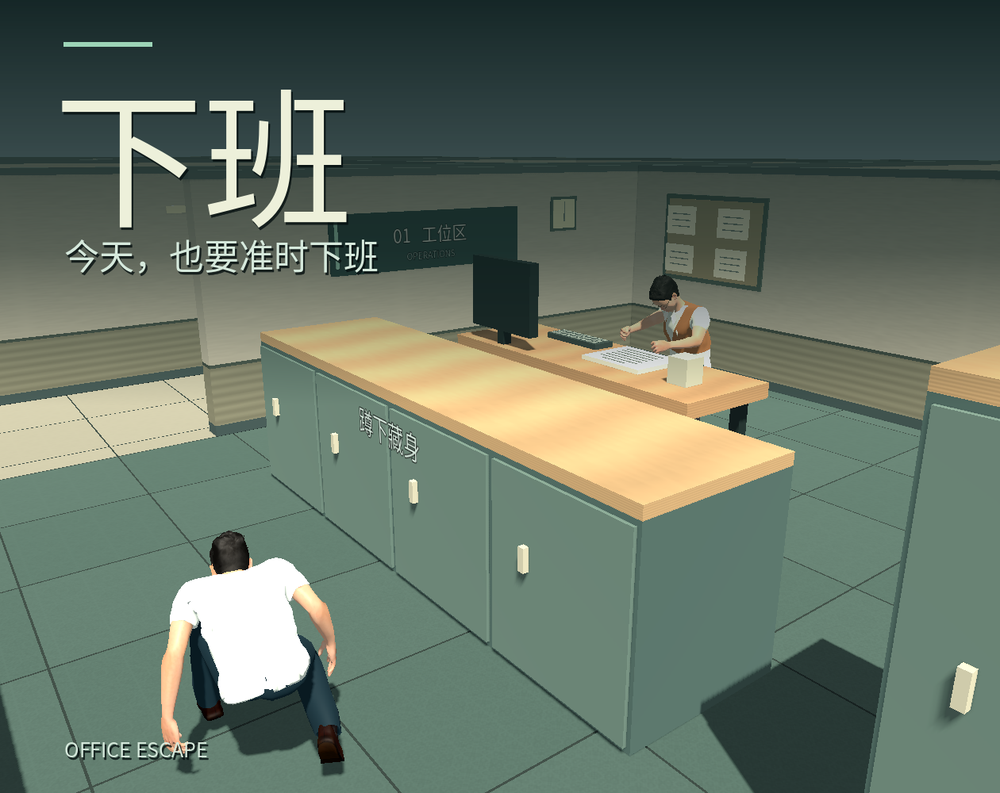
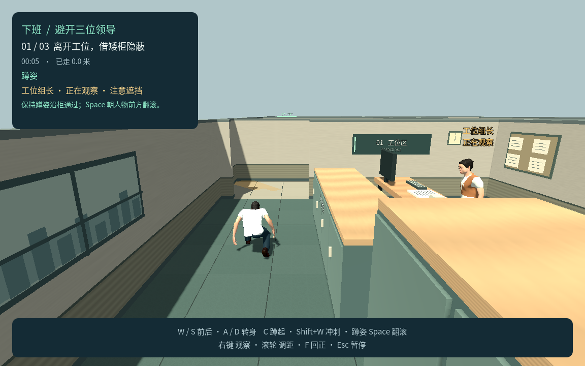

# 《下班》 / xiaban

Godot 4.7.2 / GDScript / Compatibility 制作的 3D 单人办公室潜行游戏。当前入口是 **正式第一关 release，版本 1.0.0**：从工位出发，借高低掩体绕过三位独立办公的领导，走到绿色楼梯出口。

**P5 已完成，P6 本地交付已完成；itch.io 实际托管待账号或项目页面。** 正式引擎 92／92、Chrome 整关 67／67 通过，菜单另轮 26／26 通过（不与整关相加）；macOS 导出、严格签名和本机 GPU 启动通过。Safari 26.6.2 完成真实 UI 烟测，尚未验证完整成功／失败流程。结果和支持边界见 [P5–P6 交付测试记录](docs/P5-P6交付测试记录.md)。当前未上传或公开发布。





## 启动正式第一关

在项目根目录 `/Users/mmj/Projects/games/xiaban` 执行：

```bash
bash tools/godot.sh
bash tools/build_web.sh release
python3 tools/serve_web.py --directory builds/release-web --port 8772
```

默认场景与编辑器 F5 为 `game/scenes/release.tscn`，服务运行后打开 [正式第一关本地试玩](http://127.0.0.1:8772/)。Web 预设为 `Web Release`，上传包路径 `builds/xiaban-release-web.zip`；macOS 预设为 `macOS Release`，输出 `builds/macos/Xiaban.app`。Web ZIP 为 23.75 MiB（24,901,169 B），macOS 下载包 `builds/xiaban-macos.zip` 为 75,220,970 B；两版内含 PCK 一致。一次生成双包并核验：`bash tools/build_release.sh`。校验值与授权清单见交付记录。

macOS 包采用本地开发签名，未做 Apple 公证，不属于 Mac App Store 分发。游戏面向电脑键盘和鼠标，不支持手机触屏。Safari 仅完成加载、蹲起／翻滚、暂停／继续、全屏进退和切标签暂停烟测，不能据此宣称完整整关兼容；Windows 尚无本次实机验证。

## 玩法与操作

| 操作 | 输入 |
|---|---|
| 前进／倒退、左右转身 | W／S、A／D；以人物朝向为准，A／D 不横移 |
| 蹲下／尝试站起 | C；完整站立空间不足时保持蹲姿 |
| 冲刺 | 站姿按住 Shift + W；蹲姿按 Shift 不自动站起 |
| 向前翻滚 | 蹲姿按 Space，锁定开始时人物朝向，途中不能手动取消 |
| 环绕观察、调距、回正 | 右键左右拖动、滚轮、F |
| 暂停／继续 | Esc；暂停界面选择“点击继续” |
| 音量与灵敏度 | 菜单／暂停界面，音量 0～100%、灵敏度 0.5～2.0 倍，本机保存 |

每段先在高柜后观察，等领导低头再走向矮柜；柜端或门口需要重新判断时机，先转好方向再翻滚。高柜与矮柜之间不是连续遮挡，不能一路蹲着就保证安全。翻滚受阻会停止位移，完成剩余动作后回到蹲姿；完整动作需要足够空间，不用于钻桌底。

领导低头时不进行视觉发现；抬头观察后，实际看见头部或胸口并持续短暂确认即失败，无追逐或抓捕。黄色区域是观察方向的辅助提示，真正可见仍按实际姿态与掩体判断。冲刺声可能引起附近领导抬头转向声源，声音本身不判失败；翻滚安静但不隐身。三位领导独立感知，不共享玩家位置。

正式表现使用同一成人骨架与动作：主角为浅色衬衫领短袖和工牌；组长为棕色背心、圆框眼镜；主管为蓝色马甲、低束发；经理为深灰西装、酒红领带和方镜。三位领导分别敲键盘、翻文件和夹板书写。办公室加入暖灰墙、木质家具、地毯与地砖、导向牌和壁面装饰；声音包括办公环境、动作、注意与结算反馈。

C、Shift、Space 及镜头、速度、翻滚距离、办公周期与发现时间均为当前可调默认，不表示用户已逐项确认最终手感。完整说明见 [第一关试玩说明](docs/第一关试玩说明.md)与 [运行与导出](docs/运行与导出.md)。

## 独立保留的阶段样板

| 版本 | 场景 | Web 构建参数 → 目录／端口 | macOS 应用 |
|---|---|---|---|
| P1 胶囊与镜头 | `game/scenes/p1.tscn` | `p1` → `builds/web` / 8766 | `XiabanP1.app` |
| P2 人形动作样板 | `game/scenes/p2.tscn` | `p2` → `builds/p2-web` / 8767 | `XiabanP2.app` |
| P3 完整角色控制 | `game/scenes/p3.tscn` | `p3` → `builds/p3-web` / 8769 | `XiabanP3.app` |
| P4a 单领导潜行 | `game/scenes/p4.tscn` | `p4` → `builds/p4-web` / 8770 | `XiabanP4.app` |
| P4b 三领导完整路线 | `game/scenes/p4b.tscn` | `p4b` → `builds/p4b-web` / 8771 | `XiabanP4Full.app` |

例如运行旧 P4b：`bash tools/godot.sh res://scenes/p4b.tscn`。其 `p4b` feature 与 `Web P4 Full`／`macOS P4 Full` 预设独立保留。`bash tools/build_web.sh` 不带参数默认导出正式版；也可明确加 `release`。P2 数字 1–6 原地展示和 0 返回行走只属于 P2；P3 无领导 AI。`Web P2 Benchmark` 与 `game/tests/p2_performance.tscn` 保留同模渲染基线。

[P1](docs/P1测试记录.md)、[P2](docs/P2测试记录.md)、[P3](docs/P3测试记录.md)、[P4a](docs/P4测试记录.md)、[P4b](docs/P4完整关卡测试记录.md) 的测试数、截图和产物摘要分别属于对应阶段，不能用旧包通过结果代替当前正式包。

## 设计、资源与交付记录

- [P5–P6 交付测试记录](docs/P5-P6交付测试记录.md)：正式角色、整关、浏览器与最终产物的实际验收。
- [开发计划](开发计划.md)、[设计确认](设计确认.md)、[项目设定](项目设定.md)：阶段状态、已确认规则和可调默认。
- [运行与导出](docs/运行与导出.md)、[第一关试玩说明](docs/第一关试玩说明.md)、[itch 页面文案](docs/itch页面文案.md)：操作、构建与发布准备。
- [镜头交互确认](docs/镜头交互确认.md)：D 构图、人物朝向跟随、观察、调距和回正。
- [人物资源选型](docs/人物模型与动画资源选型.md)、[素材授权](docs/素材授权.md)：MPFB／MakeHuman CC0 人体、Quaternius Standard-1.0 动画，以及项目原创外观和反馈的来源。

## v0.1 历史归档

最初的 3D 斜俯视原型备份于 [`2D-version`](https://github.com/mengmengjiang1999/xiaban/tree/2D-version)（`d0233cd`）。旧版的世界坐标移动、警戒追赶、抓捕、无声音侦测和固定检测点属于历史行为，不能作为当前规则。


[第一阶段计划](开发计划-v0.1归档.md)、[旧关卡设计](docs/第一关设计.md)、[旧任务清单](docs/第一关任务清单.md)、[旧测试记录](docs/第一关测试记录.md)和 [M0 记录](docs/M0测试记录.md)保留原始证据。试玩说明和 itch 页面文案已更新为正式第一关，不再作为 v0.1 操作说明。

旧场景仍可执行 `bash tools/godot.sh res://scenes/main.tscn`，其 `res://tests/level_test.gd` 与 `res://tests/playthrough.gd` 只验证旧行为。旧目录和 Git 历史保留，后续开发入口为当前项目目录。
