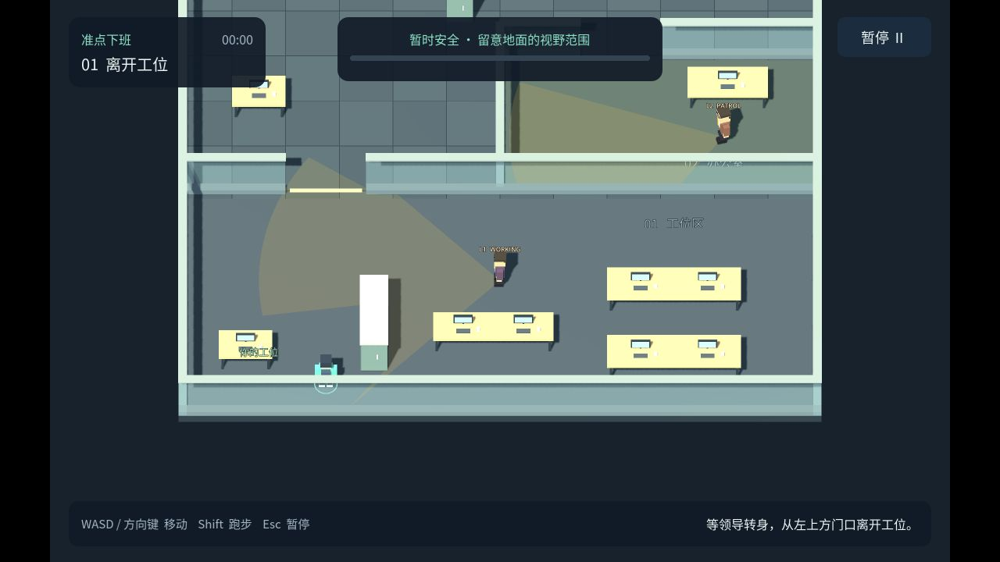

# 《下班》 / xiaban

Godot 4.7.2 / GDScript / Compatibility 制作的 3D 单人办公室潜行游戏。**当前完成 P2：一个人形角色与动作样板**，已接入约 1.75 米成人、53 根骨骼、6 个蒙皮网格及六段动画。最终 61 项引擎测试通过，并已生成 Web 与 macOS 构建；实机、浏览器和性能证据见 [P2 测试记录](docs/P2测试记录.md)。P1 已完成并保留；P3～P6 的完整动作控制与新潜行规则尚未实现。

P2 复用办公室和右肩镜头：W 前进、S 倒退、A/D 左右转身；右键环绕、滚轮调距、F 快速回正。正常步行速度为当前样板参数 1.65 米／秒。数字 1–6 只播放站立、行走、跑步、蹲姿、蹲走、翻滚的**原地动作展示**，0 返回行走试玩；它们不改变碰撞体高度或产生冲刺／翻滚位移，不定义 P3 的最终按键。

人物使用 MPFB 2.0.17 与 MakeHuman 官方 CC0 系统资产，动画来自 Quaternius 在 Godot 官方资产商店发布的免费 **Universal Animation Library Standard-1.0**。具体来源、重定向及验证边界见 [人物资源选型](docs/人物模型与动画资源选型.md)和 [P2 测试记录](docs/P2测试记录.md)。

当前目录 `/Users/mmj/Projects/games/xiaban` 是后续开发入口；旧目录保留，Git 历史和 `2D-version` 备份已带入这里。

## P2 运行入口

在项目目录 `/Users/mmj/Projects/games/xiaban` 执行：

```bash
bash tools/godot.sh res://scenes/p2.tscn
```

工程入口为 `game/project.godot`，编辑器默认主场景已切换为 `game/scenes/p2.tscn`；直接执行 `bash tools/godot.sh` 或在编辑器按 F5 即运行 P2。打开编辑器：

```bash
bash tools/godot.sh --editor
```

P2 回归入口：

```bash
bash tools/godot.sh --headless --fixed-fps 60 --script res://tests/p2_test.gd
```

P2 Web 构建与本机服务命令如下；服务开启后打开 [P2 本地试玩页](http://127.0.0.1:8767/)。本轮 Web ZIP 为 23.64 MiB，原生应用为 `builds/macos/XiabanP2.app`。构建与浏览器验收边界以 [P2 测试记录](docs/P2测试记录.md)为准。

```bash
bash tools/build_web.sh p2
python3 tools/serve_web.py --directory builds/p2-web --port 8767
```

点击开始体验／继续进入操作，Esc 暂停并释放鼠标；失焦后需要明确点击继续。低顶站起检查、蹲姿碰撞、冲刺条件、翻滚位移与领导感知属于 P3～P4。

## 保留的 P1 原型

P1 胶囊场景 `game/scenes/p1.tscn`、Web 目录 `builds/web`、8766 验收端口与 `XiabanP1.app` 保留。`bash tools/build_web.sh` 不带参数时仍导出 P1。P1 已通过的 86 项基础回归、8 项几何回归、15 项稳定性检查和 43 项 Chrome 检查记录在 [P1 测试记录](docs/P1测试记录.md)，不能替代人形资产的 P2 验收。

## 当前设计与后续阶段

- [运行与导出](docs/运行与导出.md)：P2 与 P1 的独立入口、构建和操作。
- [P2 测试记录](docs/P2测试记录.md)：人形、动画、新构建及性能的实际验证结果。
- [P1 测试记录](docs/P1测试记录.md)：通过结果、实机画面、频闪修复及平台验证边界。
- [设计确认](设计确认.md)：最新已确认行为、未决问题和本轮实施授权。
- [项目设定](项目设定.md)：玩法范围、版本边界与决策历史。
- [开发计划](开发计划.md)：P1～P6 工作顺序、状态与验收标准。
- [镜头交互确认](docs/镜头交互确认.md)：D 构图、人物朝向跟随、右键环绕、调距和回正。
- [人物模型与动画资源选型](docs/人物模型与动画资源选型.md)：本轮实际采用的人形、动作来源及 P2／P3 边界。
- [素材授权](docs/素材授权.md)：已有素材来源与许可记录。

完整潜行的新规则已确认：领导低头办公时不进行视觉发现；抬头后实际看见并经过短暂确认即失败，无追逐或抓捕阶段。冲刺声可引起抬头／转头注意，翻滚安静，各领导不共享发现信息。这些规则安排在后续阶段，P2 动作展示不代表它们已经实现。

Mac 为开发环境，发布目标为 itch.io 电脑浏览器版本；尚未创建页面或公开发布。浏览器与系统支持范围只按本轮实际验证记录声明。

## v0.1 历史归档

第一阶段是 3D 斜俯视原型，备份于 [`2D-version`](https://github.com/mengmengjiang1999/xiaban/tree/2D-version)（`d0233cd`）。旧版的世界坐标移动、警戒追赶、抓捕、无声音侦测和固定姿态检测属于历史行为，不能作为当前方案。



以下文档和测试保留为旧版证据，不用于证明 P1 或后续新规则已通过：

- [第一阶段开发计划归档](开发计划-v0.1归档.md)、[第一关设计](docs/第一关设计.md)、[第一关任务清单](docs/第一关任务清单.md)。
- [旧版试玩说明](docs/第一关试玩说明.md)、[旧版测试记录](docs/第一关测试记录.md)、[M0 测试记录](docs/M0测试记录.md)。
- [旧版 itch 页面文案](docs/itch页面文案.md)、[itch.io 发布与 Steam 迁移](docs/itch发布与Steam迁移.md)。

旧版回归命令为 `bash tools/godot.sh --headless --script res://tests/level_test.gd`，旧版输入回放为 `bash tools/godot.sh --headless --fixed-fps 60 --script res://tests/playthrough.gd`。它们只验证保留的旧场景；旧 Web ZIP 与 macOS 构建也不代表 P1。
