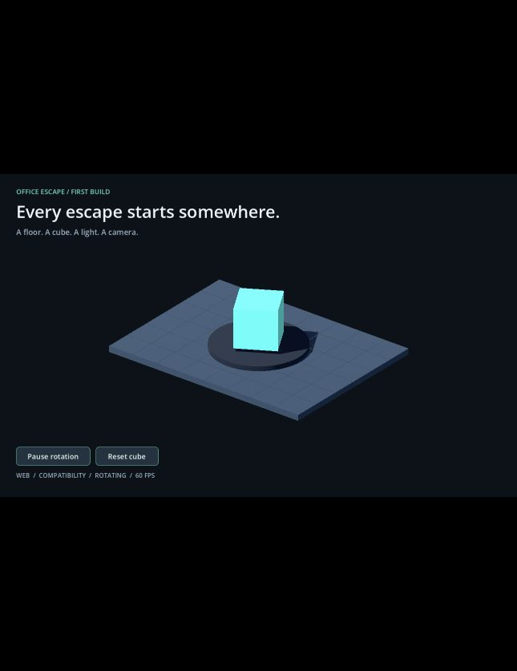

# M0 测试记录

日期：2026-09-19 
结论：最小工程、Web 构建和本机桌面运行的核心路径通过；Safari 兼容性待补测。

## 环境与产物

- 开发系统：macOS 26.6.2，arm64；桌面运行实际使用 Apple M4 图形设备。
- 编辑器：Godot 4.7.2.stable.official.ed1daf0bf。
- 渲染：Compatibility。
- Web：单线程，无 GDExtension，无 PWA。
- Mac：Universal，本地 ad-hoc 签名，无公证。
- 工程：`game/project.godot`。
- Web：`builds/web/index.html`。
- itch 格式包：`builds/office-escape-m0-web.zip`。
- 桌面构建：`builds/macos/OfficeEscape.app`。

## 检查结果

| 检查 | 结果与证据 |
|---|---|
| 编辑器版本 | 命令输出 4.7.2.stable.official.ed1daf0bf |
| 官方模板完整性 | SHA256 与官方发布资产一致，见下方 |
| 工程导入与脚本加载 | 通过；正常权限下导入完成，无脚本解析错误 |
| 无界面场景运行 | 通过；输出 `M0_READY platform=macOS renderer=gl_compatibility` 并退出 0 |
| Web Release 导出 | 通过，退出 0，入口与 WASM/PCK 等文件完整 |
| 内置 Chromium 浏览器渲染 | 实际看到地板、方块、灯光、阴影和界面，观察时显示约 60 FPS |
| 网页暂停、恢复、重置 | 实际点击验证，界面状态变化；控制台出现 rotation=false、reset、rotation=true |
| 网页窗口适配 | 默认窄面板与 1024×640 视口均可见场景和按钮，保持设计比例 |
| 网页控制台 | 检查时没有 error/warn；有 WebGL2、单线程和 M0_READY 日志 |
| Chrome 原生窗口 | 通过打开本机网址及截图看到 3D 场景，观察时约 60 FPS；该窗口后续输入自动化不稳定，按钮完整验收使用内置 Chromium |
| macOS Release 导出 | 通过，退出 0 |
| macOS 签名与架构 | `codesign --verify --deep --strict` 通过；lipo 显示 x86_64、arm64 |
| Mac 窗口画面 | 实际截图可见场景；观察时约 120 FPS，不作为性能基准 |
| Mac 独立图形运行 | 导出可执行文件运行 180 帧后退出 0；日志显示 OpenGL 4.1 Metal、Apple M4 和 M0_READY |
| Mac 按钮交互 | 未完成可靠验收；窗口自动化返回 noWindowsAvailable，不能据此认定按钮本身失败 |
| Safari | 未完成：系统应用自动化连接超时，不能声明已兼容 |
| 音频、存档、角色移动与碰撞玩法 | 本阶段未加入，不在通过范围内 |
| itch.io 实际页面 | 未创建或上传，待正式发布阶段验收 |

桌面运行标准错误曾出现一条 macOS 输入法服务的 mach port 提示；游戏图形正常初始化并退出 0，未观察到 GDScript 运行错误。保留这个观察，不将其归为已经修复的游戏问题。

## 本阶段处理的问题

1. 初次沙箱运行不允许写 Godot 的正常用户数据与缓存目录；取得本轮授权后使用正常权限重新导入，通过。
2. 初次导出 Universal macOS 构建缺少 ETC2/ASTC 导入设置；补齐项目纹理导入配置后重新导出、验证签名并运行，通过。
3. 浏览器使用 HTTP 服务加载，正确提供 WASM MIME；避免 `file://` 本地打开造成的限制。

以上为首次环境搭建时完成的配置调整。

## 官方模板来源

- [Godot 4.7.2 官方发布资产](https://github.com/godotengine/godot-builds/releases/expanded_assets/4.7.2-stable)
- 文件：`Godot_v4.7.2-stable_export_templates.tpz`
- SHA256：`f298490b8d44d934be425a5a65a51bf15f422428b229a06a6e11d9ffea248011`
- 仅安装 `web_nothreads_debug.zip`、`web_nothreads_release.zip`、`macos.zip` 和 `version.txt`。

## 截图

## 下一步

可以进入 M1：胶囊角色移动、摄像机跟随、墙体碰撞。同时补测 Safari 和 Mac 窗口按钮。尚不能宣布完整游戏、所有浏览器或其他系统已经通过测试。
