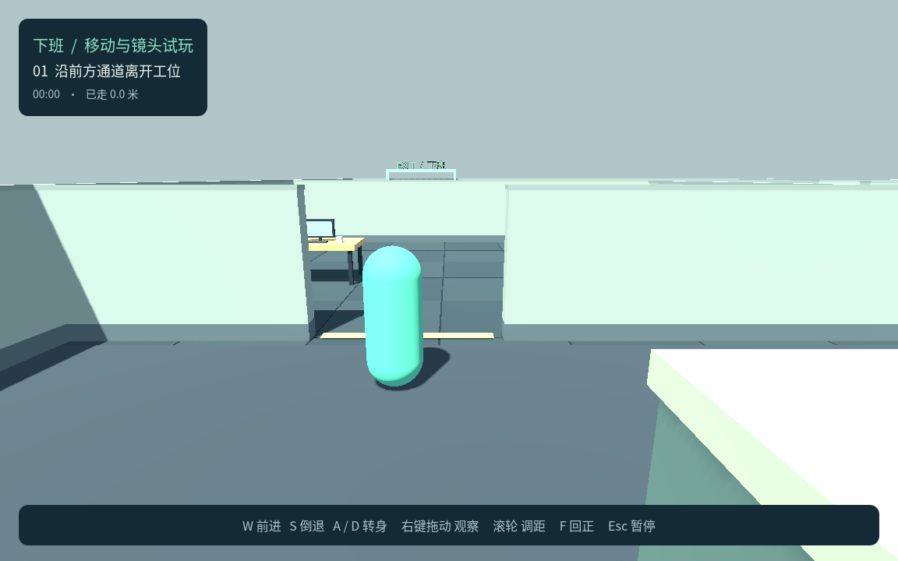
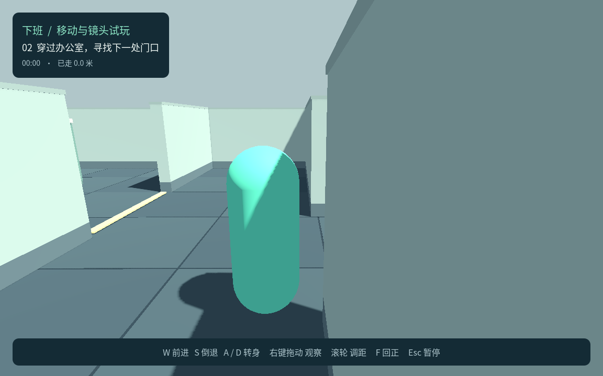

# P1：基础移动与右肩镜头测试记录

日期：2026-09-21<br>
状态：**P1 本轮完成，频闪修复及 Chrome 验收通过。86 项基础回归、8 项几何回归、15 项镜头稳定性检查（包含原路线 9 项）和新版 Chrome 43 项浏览器检查全部通过；Web 与 macOS 构建及本机画面已更新。**

本记录只覆盖 P1 胶囊移动与镜头原型。P2～P6 的完整人形、蹲走／冲刺／翻滚、领导感知和完整潜行玩法尚未实现；旧版测试不作为这些规则的证据。当前操作及启动方法见 [运行与导出](运行与导出.md)，设计依据见 [设计确认](../设计确认.md)。

## 1. 环境与入口

| 项目 | 本轮记录 |
|---|---|
| 工程 | `/Users/mmj/Projects/games/xiaban/game/` |
| 引擎 | Godot `4.7.2.stable.official.ed1daf0bf` |
| 语言与渲染 | GDScript / Compatibility |
| 当前默认场景 | `res://scenes/p1.tscn` |
| 回归脚本 | `res://tests/p1_test.gd` |
| 测试方式 | Headless，固定 60 FPS，实例化真实 P1 场景 |
| 本轮测试日志 | `.logs/p1-regression-final.log`，本机验证产物，不作为仓库内持久附件 |

命令：

```bash
bash tools/godot.sh --headless --fixed-fps 60 --script res://tests/p1_test.gd
```

日志结果：

```text
P1_TEST_RESULT passed=86 failed=0
```

## 2. 自动回归通过范围

| 范围 | 验证结果 |
|---|---|
| 开始与状态 | 菜单打开、开始进入试玩、到达出口结束路线体验 |
| 移动与转身 | W/S 在四个朝向下正确前进／倒退；不因倒退转身或反转镜头；A/D 原地转身不横移；移动与转身可同时进行；反向输入抵消，释放按键后停止 |
| 镜头跟随 | 初始位于人物右后方；原地转身也跟随人物朝向；观察时移动不抢回镜头；停止观察后静止保留观察角，倒退时平滑回到人物朝向后方 |
| 输入事件 | Godot 的 W/S/A/D 键盘事件、右键按下／松开、鼠标水平移动、滚轮远近与 F 回正按键到达正确逻辑 |
| 镜距与回正 | 滚轮远近限幅；F 快速回正；回正保留玩家选择的镜距；离开障碍后恢复所选距离 |
| 玩家碰撞 | 行走不会穿过墙体与低矮桌体 |
| 镜头避障 | 右墙、墙角、窄门、背后墙与低桌五类场景，各测 24 个环绕角度，共 120 个角度组合；相机球体不侵入障碍，人物锚点到镜头的视线未穿障碍 |
| 近距显示与观察优先 | 相机贴近时角色淡化，离开后恢复；不改变碰撞体与碰撞层。F 回正不被纯竖向鼠标运动取消，再次主动观察可接管镜头 |
| 姿态分离 | 改变模型局部高度、缩放与旋转模拟蹲起／翻滚后，相机位置和旋转保持稳定；此项不代表已实现正式动作 |
| 暂停与重试 | 暂停停止位移并清理观察与按键状态；继续、重试、回菜单和重新开始恢复正确阶段及出生点，无残留输入；全屏退出引起的暂停不会在同一帧被出口完成状态覆盖 |

86 是基础回归脚本断言总数；120 个避障角度按五类场景汇总为对应断言，并非额外的 120 项测试。几何与镜头连续性使用独立回归入口。

镜头当前原型参数包括 **0.22 米球体半径、1.3 米人物锚点高度**。避障从人物锚点沿包含完整右肩偏移的方向直接球扫；另对未来 0.4 秒内 8 个位置取样，提前平滑收缩并限制镜头变化速度。当前几何碰撞仍是硬约束，不能为平滑而穿墙，离开后平滑恢复所选镜距。这些参数用于当前原型验证，不视为最终镜头规格。

几何回归 **8 项通过、0 失败**，验证墙面与墙裙不再共面、地毯表面互不重叠且高于地砖，并保持玩家碰撞和旧版几何不变：

```bash
bash tools/godot.sh --headless --script res://tests/p1_geometry_test.gd
```

## 3. 完整路线与本机图形

`p1_playthrough.gd` 通过实际 W/A/D 与 Escape 事件走完办公室，未传送、关闭碰撞、冻结逻辑或直接调用胜利函数。

```bash
bash tools/godot.sh --headless --fixed-fps 60 --script res://tests/p1_playthrough.gd
```

最终结果：9 项通过、0 失败，实际行走 50.940 米、用时 23.483 秒，最大路线偏差 0.104 米。全程相机球体重叠与人物锚点至镜头的穿墙次数均为 0。

`p1_camera_stability_test.gd` 在上述路线基础上补充逐渲染帧连续性、四处窄角静止与微小右键观察检查。两种渲染帧率均 **15 项通过、0 失败**，其中包含原路线 9 项，不能相加为 24 项：

```bash
bash tools/godot.sh --headless --fixed-fps 60 --script res://tests/p1_camera_stability_test.gd
bash tools/godot.sh --headless --fixed-fps 120 --script res://tests/p1_camera_stability_test.gd
```

| 稳定性指标 | 60 FPS 渲染／60 FPS 物理 | 120 FPS 渲染／60 FPS 物理 |
|---|---|---|
| 整条路线采样 | 1,406 个渲染帧 | 2,812 个渲染帧 |
| 路线相机最大单帧位移 | 0.251837 米 | 0.254134 米 |
| 四处窄角各静止 300 帧 | 人物、镜头及透明度漂移均为 0 | 人物、镜头及透明度漂移均为 0 |
| 900 帧微小右键观察最大单帧位移 | 0.002937 米，约 3 毫米 | 0.002105 米 |
| 微小观察透明度变化／材质切换 | 0／0 | 0／0 |
| 相机球体重叠／锚点至镜头穿墙 | 0／0 | 0／0 |

120 FPS 渲染检查覆盖两个物理更新之间的渲染帧，避免只在物理帧后采样漏掉画面跳动。日志为 `.logs/p1-camera-stability-final.log` 与 `.logs/p1-camera-stability-120.log`。

修复后已重新生成 `builds/macos/XiabanP1.app`（ad-hoc 签名，未公证），可供本机试玩；导出成功不作为独立完整输入验收。

本机 Godot 图形渲染在 Apple M4、OpenGL 4.1 Metal、1152×720 下启动。修复后已重新生成并目检 `p1_visual.gd` 的出生点、办公室、窄角和门口四张画面；这是**静态画面验收，不是玩家输入通关证据**。窄角样例中角色完整可见（alpha 1.0），门口极近镜距样例仍按规则淡化到 alpha 0.12，碰撞保持原状。此前动态本机回放因失焦暂停，不能记为完整本机图形通关。





静态画面复现：

```bash
bash tools/godot.sh --fixed-fps 60 --resolution 1152x720 --script res://tests/p1_visual.gd -- --output=/tmp/xiaban-p1-visual-samples
```

## 4. Web 构建

| 项目 | 本轮结果 |
|---|---|
| 导出命令 | `bash tools/build_web.sh` |
| 配置 | 修复后重新导出；Web Release、Compatibility、单线程 |
| 页面入口 | `builds/web/index.html` |
| 可上传 ZIP | `builds/xiaban-p1-web.zip` |
| 包体 | 17.05 MiB |
| 完整性 | 打包脚本检查 ZIP 可读且根目录存在 `index.html`，包含 Godot 与字体许可 |
| 本次验收地址 | [P1 本机页面](http://127.0.0.1:8766/)，需运行 `python3 tools/serve_web.py --port 8766` |
| 默认服务地址 | [默认端口页面](http://127.0.0.1:8765/)，对应不带 `--port` 的命令 |
| 发布 | 未上传或公开发布到 itch.io |

导出成功只证明构建产物生成与打包完成，不自动证明浏览器输入和托管环境已通过。

## 5. 浏览器实际验收与剩余边界

- 用户已明确授权使用独立 Playwright 验收。原电脑控制工具的 `noWindowsAvailable` 属于此前工具限制，不再是等待授权的阻塞项。
- 修复后的 Chrome `149.0.7827.54` 后台测试已通过 **43 项、0 失败**，覆盖开始／继续捕获、W/S/A/D、右键环绕、滚轮、F、Esc 释放、标签页切换与恢复、全屏与普通试玩地址、完整办公室输入路线、逐帧镜头稳定性及允许／拒绝捕获的 iframe。独立页面与允许捕获的 iframe 均无游戏脚本或运行时错误。
- 最终浏览器路线实际行走 **50.820 米**，用时 **20.367 秒**，记录 **1,156 帧、1,154 组有效相邻采样**。最大相机单帧位移 **0.228356 米**，按 60 Hz 换算的最大位移同为 **0.228356 米**；角色透明度最大单步变化 **0.178801**。实际键鼠输入约 10 秒、行走 26.3 米处的 `.logs/p1-browser/office-corner.png` 已目检，角色完整可见，墙裙无重叠。
- 独立有界面 Chrome 的 **37 项交互基线**和独立窗口失焦增测在频闪修复前通过。后台模式不能创建原生窗口，原生窗口失焦在新版后台报告中明确跳过，未计作通过；有界面与后台结果分别保留其验证边界。
- Safari 已实际加载并显示中文菜单，尚未完成真实交互验收；不将 Chrome 结果推广为 Safari 支持。
- 应用内 Chromium 已加载 P1 场景并输出 `P1_READY platform=Web`；点击开始时锁定请求返回 `UnknownError`，游戏正确从 playing 回到 paused。这是该环境的失败保护证据，独立 Chrome 的成功交互另行记录。
- 本地 iframe 只验证浏览器嵌入及权限边界，不等于 itch.io 真实托管验收。尚未在 itch.io 验收或公开发布，也未验证 Windows 及其他设备。

浏览器测试入口为 `tools/test_browser.cjs`；依赖安装、默认有界面模式及 `P1_HEADLESS=1` 后台选项见 [运行与导出](运行与导出.md#playwright-浏览器验收)。引擎事件测试不等同于浏览器 DOM 输入，后台测试也不能替代真实窗口验收。报告输出到 `.logs/p1-browser/report.json`，记录 Chrome 版本、`headless` 模式、`skipped` 跳过项目及各项证据；`route-frames.json` 只读记录路线逐渲染帧状态，用于检查镜头跳变。同名文件会被后续测试覆盖。

### 试玩发现的频闪修复

- 原先窄角位置仅约 **0.008°** 的转动即可触发相机约 **2.972 米** 的瞬时位置跳变。现改用含完整肩偏移的直接球扫，并用提前收缩与限速减少移动经过障碍边缘时的跳动；保留当前碰撞硬约束。
- 墙裙与不透明墙身原先有共面表面，产生深度竞争。现将下段墙裙与上段墙面在 0.28 米高度衔接，消除可见侧面的重叠；新增测试同时验证地毯互不重叠、地毯与地砖保持既有分层，玩家碰撞与旧版外观不变。
- 修复后微小观察最大单帧位移降至 **0.002937 米**，完整路线最大单帧位移从复现时约 **3.645 米** 降至 **0.251837 米**（60 FPS 渲染）。86 项基础回归、8 项几何回归、两种渲染帧率下的 15 项稳定性回归、四张本机画面及新版 Chrome 43 项浏览器检查全部通过。

实现参考：[Godot Web 鼠标捕获说明](https://docs.godotengine.org/en/stable/tutorials/export/exporting_for_web.html#full-screen-and-mouse-capture)、[JavaScriptBridge](https://docs.godotengine.org/en/stable/classes/class_javascriptbridge.html)。页面通过 pointerlockchange、pointerlockerror、visibilitychange、blur 和 fullscreenchange 衔接安全暂停。

## 6. 版本边界

旧 `res://scenes/main.tscn` 和旧测试保留为斜俯视 v0.1 历史对照。本轮旧版 45 项回归通过，仅证明共用几何扩展没有破坏旧场景行为；旧版追赶／抓捕、世界坐标移动与无声音侦测的通过记录不能用来证明新版规则。

P1 无领导与完整潜行失败逻辑；到达出口只代表移动原型路线完成。姿态测试验证视觉节点与镜头分离，不代表碰撞体蹲起、翻滚位移、起身空间、动画或动作声音已经完成。剩余动作参数与领导行为仍按 [开发计划](../开发计划.md)进入后续阶段。
