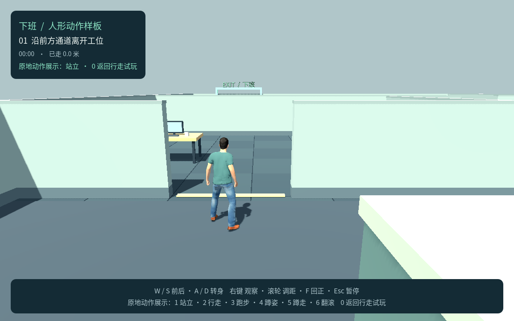
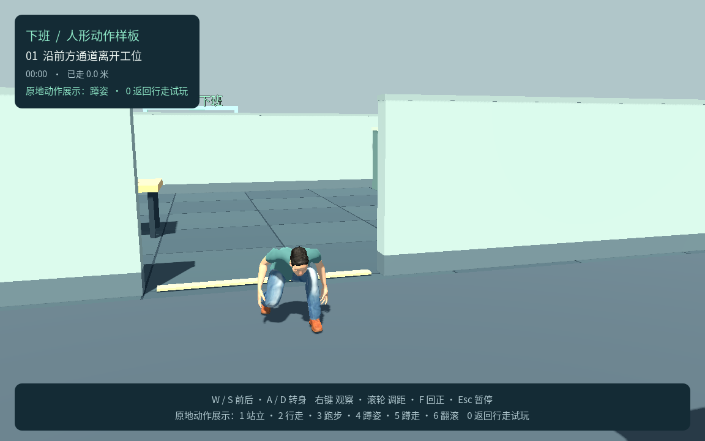
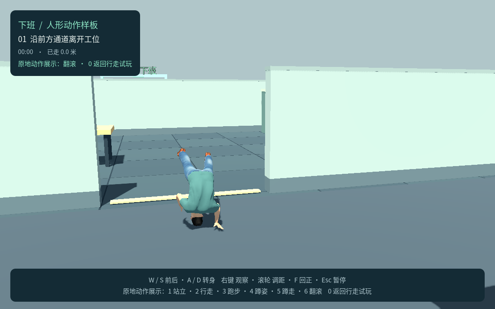

# P2：一个人形角色与动作样板测试记录

日期：2026-09-21～22。范围是一个成人骨骼模型、六段动作、正常行走及与右肩镜头的衔接。原地展示不降低碰撞体，也不产生冲刺或翻滚位移；P3 完整动作控制和 P4 领导感知尚未实现。

P2 样板已完成：最终引擎 61 项、P1 回归 86 项、P2 Chrome 完整输入 49 项及最终资产定向复核 36 项检查通过。Web／macOS 已导出，原生和 Web 四同模基线及接地采样通过。以下将最终 v4 资产与此前构建证据分开记录。

## 1. 资产与构建

| 项目 | 实际结果 |
|---|---|
| 环境 | macOS、Apple M4；Godot 4.7.2.stable.official.ed1daf0bf、GDScript、Compatibility |
| 默认入口 | `game/scenes/p2.tscn`；P1 通过独立场景和导出特性保留 |
| 人物 | 约 1.75 米成人、53 骨骼、6 个蒙皮网格、19,069 三角面、7 个材质、8 张最大 1K 纹理 |
| 来源 | MPFB 2.0.17／MakeHuman 官方 CC0 资产；Quaternius 免费 Standard-1.0，实际源包 46 段，仅六段进入游戏 |
| 动作 | `idle`、`walk`、`run`、`crouch_idle`、`crouch_walk`、`roll` |
| Web | `builds/p2-web/index.html`；`builds/xiaban-p2-web.zip` 23.64 MiB，ZIP 完整性及根目录入口检查通过 |
| 原生 | `builds/macos/XiabanP2.app`，本机签名校验及真实 OpenGL 加载检查通过 |
| 许可 | 游戏包附人形许可；完整声明、源输入校验值与再构建说明保存在 `art/characters/` |

最终 ZIP 的完整性、根目录入口、人形许可及 PCK 与本机服务的一致性已检查。最终 macOS 包通过严格签名校验，并于 2026-09-22 00:05 完成真实 OpenGL 启动；`.logs/p2-release-gpu.log` 记录 Apple M4 和 `P2_READY`。

制作脚本将 A／T 静止姿势对齐后烘焙到成人骨架，角色前方统一为 Godot −Z。翻滚首尾混合为蹲姿；骨架内部的垂直接地校正不改变玩家物理位置。正常行走由脚本驱动，速度为样板参数 1.65 米／秒，倒退反向播放行走动画。

## 2. 引擎回归

执行：

```bash
bash tools/godot.sh --headless --fixed-fps 60 --script res://tests/p2_test.gd
bash tools/godot.sh --headless --fixed-fps 60 --script res://tests/p1_test.gd
```

| 检查 | 结果 | 证据 |
|---|---|---|
| P2 最终回归 | **61 通过，0 失败** | `.logs/p2-test.log` |
| P1 工厂方法调整后的基础回归 | **86 通过，0 失败** | `.logs/p1-p2-regression.log` |

P2 覆盖真实 Skeleton3D、AnimationPlayer、有效蒙皮权重和六段带骨骼关键帧的动作；确认已移除显示用胶囊。六段动作随时间改变实际骨骼，原地展示期间 W/A 不改变位置、朝向或站立碰撞体，骨骼运动不驱动镜头。

正常 W/S 的位移、动画播放方向与人物朝向匹配；0 恢复行走。展示中右键、F 和调距仍可用，F 不重置镜距。Esc 同时冻结动画时间与骨骼姿态；暂停期间数字键不改变动作，继续恢复同一动作，重试和新会话清理展示、输入及镜头状态。

新增材质检查确认皮肤、衣服、鞋和眼睛写入不透明深度，头发和眉毛使用 cutout；近距离淡化只影响当前人物，恢复后保留原透明模式。这避免将所有表面误设为 alpha 混合而产生服装／脸部深度排序问题。

P1 历史几何、频闪与路线检查保持在 [P1 测试记录](P1测试记录.md)，本次没有将旧测试数再次计入 P2。

## 3. 真实原生画面

`game/tests/p2_visual.gd` 在本机 OpenGL 图形环境渲染 1152×720，输出 `.logs/p2-visual-v4/` 的 **16 张 PNG** 和 `p2-visual-manifest.json`。包含肩后／正面构图、五类动作各两个时点及翻滚四个时点。对成人比例、衣发鞋材质、手臂与膝盖弯曲、蹲姿和翻滚可读性进行了目检，最终样板材质完整。

这些是冻结指定动画时点的画面检查；不作为真实键鼠路线或每个中间帧无穿插的证明。最终 v4 对短袖覆盖区的身体面进行精确遮蔽，修正肩袖处的皮肤穿出，保留裸露手臂；上述采样画面已重新检查。完整动作位移留到 P3。







## 4. Chrome 真实输入

浏览器验收脚本为 `tools/test_browser_p2.cjs`，对本机 8767 端口的实际 P2 Web 构建发送键鼠输入。`?p1_qa=1&p2_qa=1` 仅开启只读状态观察，普通 URL 另行检查。

**完整交互复验 49 项通过、0 项失败**，时间为 2026-09-21 23:49:35（北京时间）。使用 Chrome **149.0.7827.54，headless**，本轮没有发生 Chrome 崩溃或意外运行／脚本错误。测试对象为 v2 Web 构建，具体 PCK 校验值在 `.logs/p2-browser/tested-build.json`；材质／接地调整后的最终 v4 资产已完成下述定向复核，两轮覆盖分别记录。

覆盖 W/S 和 A/D、右键环绕／滚轮／F、六段原地展示与 0 恢复、暂停／继续／重试、真实键鼠完成办公室路线、普通 URL 不泄露验收接口，以及允许／禁止 pointer lock 的两类 iframe。拒绝权限的 iframe 正确返回暂停菜单，其预期 console 与 pageerror 共两条只按具体来源和错误内容过滤，不放宽其他运行错误。

Chrome 启动耗时 379 ms，初始菜单约 1,377 ms；真实输入路线用时 36.85 秒，累计移动 50.3245 米。记录 2,123 个有效渲染采样，最大相机帧步 0.690145 米，按实际帧间隔归一化后最大速度 11.6555 米／秒，连续性检查通过。Web 帧间隔存在变化，不能将最大帧步单独按固定 60 FPS 解读。

针对用户反馈的 Chrome 崩溃重新验收：曾捕获沙盒启动时在 macOS `_RegisterApplication` 阶段的 SIGABRT，发生在游戏加载前；允许正常系统启动并恢复本机服务后，上述完整输入轮未崩溃。用户的运行时崩溃与这条启动错误不能直接归为同一原因，本记录只说明本次复验结果。

最终 v4 资产于 2026-09-22 00:04:09（北京时间）通过 **36 项定向检查、0 失败**，报告为 `.logs/p2-browser-assets/report.json`，覆盖六段动画、正常行走／展示切换、镜头和暂停恢复；没有重跑办公室路线、普通 URL 和 iframe，这三类保留前一轮完整结果。该轮没有意外浏览器／脚本错误。该轮实际服务 PCK 为 14,618,984 字节，SHA-256 为 `7e25e20346309a59f7d18aa6d65397452f97d3e52108b47152248aa29ee96243`，清单见同目录 `tested-build.json`。六段 Web 画面也已目检，肩袖穿出修复且裸露手臂、双手保留完整。

报告分别记录 Chrome 版本、headless 模式、逐项结果和未检查内容，49 与 36 不相加为一个独立测试总数。后台模式不能验证原生窗口失焦或真实桌面全屏体验；P1 的历史有界面结果也不能代替 P2。

## 5. 四个同模副本的性能基线

本轮额外构造一个玩家和三个相同视觉副本，分别持续播放行走、跑步、蹲走和翻滚。它们均有 53 根骨骼和 6 个网格，实际姿态持续变化；不运行领导 AI、不处理玩家物理输入，不是四个正式角色或完整潜行场景。

本机记录来自 `game/tests/p2_performance.gd`，报告 `.logs/p2-performance-native/report.json`：Apple M4、Compatibility、1152×720，预热 2 秒后采样约 5 秒；未使用固定 FPS，关闭 VSync、引擎 FPS 上限为 0。

| 指标 | 本机原生采样 |
|---|---:|
| 采样帧数／时间 | 552 帧／5.002 秒 |
| 平均帧率 | 110.35 FPS |
| 单帧耗时中位数／P95／最大值 | 8.923／10.383／13.441 ms |
| 平均绘制调用 | 723 |
| 引擎静态内存 | 约 129.28 MiB |
| 渲染器显存统计 | 约 49.66 MiB |

内存值来自 Godot 分配监视器，不是进程 RSS 或整机总占用。本机窗口被 macOS 调整到屏幕位置 (0, 130)，该原生数据不标作隐藏窗口或纯后台运行。短时本机采样不代表其他硬件、浏览器或完整 AI 场景性能。

**最终 v4 接地采样通过。** 用导入后网格的实际权重、Skin 绑定和已求值骨骼计算顶点位置，六段动作各采样 17 个时点，静止姿态重建最大误差 0.0564 mm。修正了翻滚插值阶段的穿地：此前同一时点最低顶点穿入可见地毯 30.918 mm（物理地面下方 13.918 mm），改为 60 FPS 烘焙并提高接地基准后，该时点位于可见地毯上方 8.822 mm。所有动作通过原有 30 mm 穿地容差与 60 mm 接地间隙阈值，未放宽标准；跑步保留腾空期。该检查是有限采样，不声称所有插值帧和衣物自相交均已覆盖。

最终 v4 Web 使用独立 `Web P2 Benchmark` 预设导出至 `builds/p2-benchmark/`，本机 8768 端口运行；它不混入正常 P2 试玩，也没有修改时钟来制造帧率。`tools/test_p2_performance.cjs` 在 Chrome 149.0.7827.54 headless、1152×720 下记录 **300 帧／5.000 秒，平均 60.00 FPS，单帧中位数 16.7 ms、P95 18.3 ms、最大 18.7 ms**，绘制调用 723。四个实际骨骼均持续运动，六段接地采样通过，浏览器运行错误为 0。报告与画面在 `.logs/p2-performance-web/`。

Web 保持浏览器垂直同步（报告为 1），原生关闭同步，二者不能用于比较最大渲染吞吐量。浏览器只报告 `WebKit WebGL`，不据此推断具体 GPU 后端。Web 渲染器显存统计约 53.61 MiB；引擎静态内存监视器返回 0，视为该运行环境不可用，不能解释为零内存占用。此独立性能场景准备约 833 ms，仅为本次本机运行观察；完整页面、网络、设备和领导 AI 增加后仍须复验。

基线重现命令如下，运行服务时另开终端执行 Node 脚本。第一条原生图形性能命令使用本机 GPU，不加 `--headless` 或 `--fixed-fps`：

```bash
bash tools/godot.sh --rendering-method gl_compatibility --resolution 1152x720 --script res://tests/p2_performance.gd -- --output=/tmp/xiaban-p2-performance
bash tools/godot.sh --headless --export-release 'Web P2 Benchmark' ../builds/p2-benchmark/index.html
python3 tools/serve_web.py --directory builds/p2-benchmark --port 8768
node tools/test_p2_performance.cjs
```

Web 导出命令本身可 headless，它不进行图形性能测量。三个试玩／验证端口分别为 P1 8766、P2 8767、独立性能场景 8768。

## 6. 交付与未覆盖范围

P2 可从 [8767 本机页面](http://127.0.0.1:8767/) 试玩，需保持本机服务运行。点击开始后 W/S 行走、A/D 转身；1–6 看原地动作，0 返回行走，Esc 暂停。具体命令见 [运行与导出](运行与导出.md)。

P2 不包含蹲姿碰撞体和视线采样、低顶站起检查、冲刺条件／声音、翻滚位移／碰撞、三位领导或新潜行失败规则。这些按 [开发计划](../开发计划.md) 进入 P3～P5，正式按键和未确认动作边界仍需对齐。

Safari 完整交互、原生 Chrome 窗口切换、真实 itch.io 托管、其他操作系统和低端设备未在本轮 P2 中验证。macOS 应用未公证，Web 包未公开上传。本轮完成的是单个人形与动画样板，不是完整第一关的发行验收。
