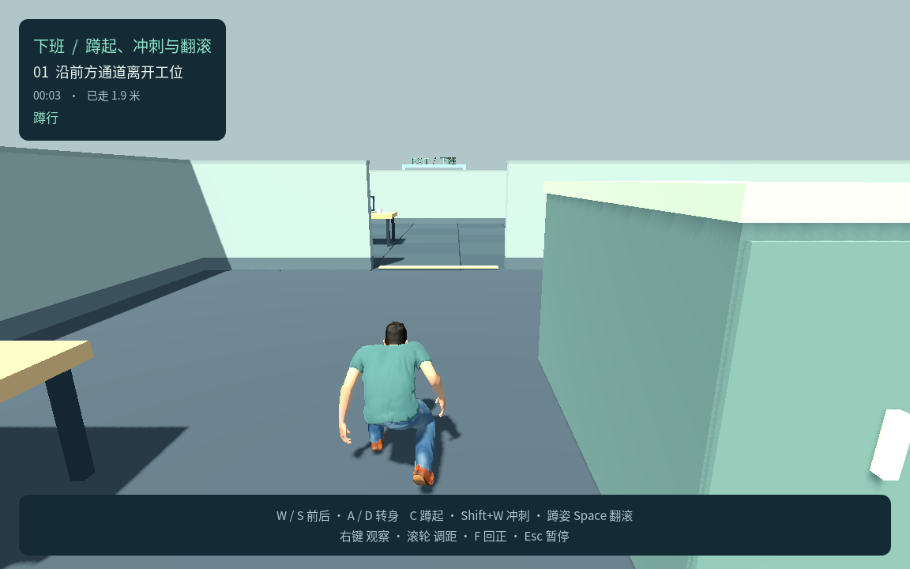
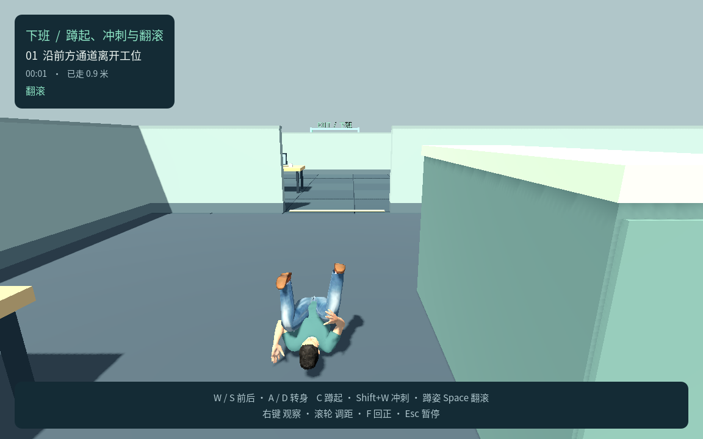

# P3 完整角色控制：测试记录

更新日期：2026-09-22

**状态：P3 已完成。** 72 项控制、18 项实际蒙皮接地、22 项姿态空间检查及最终 Web 包的 42 项 Chrome 检查全部通过；P1 86 项和 P2 61 项本轮回归通过。Web 与 macOS 最终产物内容一致，原生签名与 Apple M4 GPU 启动通过。用户授权的完整蹲起、冲刺和翻滚控制已交付；键位与手感数值保留可调，领导感知和完整潜行闭环仍属尚未实施的 P4。

## 范围与当前试玩参数

- 默认入口：`game/scenes/p3.tscn`；P1、P2、P2 性能基线独立保留。
- 当前默认：C 切蹲起，站姿 Shift + W 冲刺，蹲姿 Space 沿人物正前方翻滚；蹲姿 Shift 不自动起身，翻滚锁向、不可手动取消，碰撞立即停止位移，原地播完剩余动作后恢复为蹲姿。
- 当前移动速度：步行 1.65 米／秒、蹲行 0.75 米／秒、冲刺 3.8 米／秒。
- 当前碰撞尺寸：站立高 1.80 米、蹲姿高 1.05 米、半径 0.35 米；站起检查完整目标体积。
- 当前翻滚目标 2.4 米、动作 0.85 秒、恢复 0.20 秒；动画最高约 1.476 米，按宽 1.06 × 高 1.55 × 长 2.20 米包络检查路径空间，不允许桌底爬行。
- 上述按键、尺寸和手感参数是可调整的试玩方案，不表示用户已确认最终数值。
- P3 验证声音事件与脚步反馈；领导听觉、视觉、发现失败和信息独立性属于 P4，当前不宣称通过。

## 已执行：姿态空间检查

```bash
bash tools/godot.sh --headless --fixed-fps 60 --script res://tests/stance_collision_test.gd
```

Godot `4.7.2.stable.official.ed1daf0bf`，**22 项通过、0 项失败**。测试在真实物理空间中创建地面、低顶、侧边突出物和另一 CharacterBody3D，检查完整 capsule 查询、自身排除、碰撞掩码、15 毫米顶部／侧边余量、2 毫米接地容差、脚边障碍和独立 shape。该独立测试使用 1.75 米目标站高验证通用几何助手；下列 P3 集成测试另覆盖实际 1.80 米站高。

原始日志：`/tmp/xiaban-stance-collision.log`。当前 sandbox 中引擎输出一次系统证书读取提示，脚本正常完成且进程返回 0；该提示不属于碰撞测试失败。

## 已执行：P3 控制集成回归

```bash
bash tools/godot.sh --headless --fixed-fps 60 --script res://tests/p3_test.gd
```

**最终 72 项通过、0 项失败**，包含受阻后物理位置冻结而翻滚动画继续的 4 项检查，以及按真实侧滑位移调节动画速度和脚步间隔的 2 项检查。原始日志 `/tmp/xiaban-p3-test.log`。使用真实导入人形、动作状态、Godot 物理和实际输入事件，覆盖：

- 1.80 米站立与 1.05 米蹲姿碰撞切换、脚底稳定、头胸骨骼采样降低、独立镜头不随姿态升降；键盘重复事件不会反复切蹲。
- 低顶、侧上方突出物阻止站起；移除或离开障碍即可恢复。蹲姿能容纳但动画包络不能容纳的低顶会阻止翻滚。
- 蹲走的前进／倒退方向与动画对应；仅站姿 Shift + W 冲刺，Shift 单按、倒退或蹲姿不冲刺。实际跑动发送有限半径声音事件，顶住墙不持续发跑步声；斜墙侧滑时，动画速度与脚步间隔按真实位移调节，不按期望的全速移动重复播放。
- 蹲姿翻滚锁定初始身体朝向；A、C、Shift 不转向、不取消、不站起。动作结束回蹲姿并经历恢复，恢复期间不能继续位移或连滚，按住 Space 不自动重复。
- 薄墙、偏心桌角、窄门、另一实体阻止翻滚位移穿透。当前碰撞响应调整为立即停位移、在已检查通过的原地包络内播完剩余翻滚，再进入 0.20 秒恢复并回蹲姿；不延长原有翻滚时长，避免中途直接混合到蹲姿导致模型穿地。该响应已通过控制回归与下列实际蒙皮接地检查。
- 蹲姿、冲刺和翻滚中暂停冻结位置、场景时间、动画与动作计时，停止声音并清空旧输入；继续翻滚保留动作进度，重试和回菜单清理状态。
- 快速交替 C／Shift／Space、翻滚穿越出口后的结算与重试。

真实物理频率对照：

| 物理频率 | 翻滚实测距离 | 测试观察的完成时间 |
|---|---|---|
| 30 Hz | 2.4000 米 | 0.8667 秒 |
| 60 Hz | 2.4000 米 | 0.8500 秒 |
| 120 Hz | 2.4000 米 | 0.8667 秒 |

时间包含测试帧观察的离散误差；三个频率的距离一致，完成时间在集成测试允许的帧级容差内，不宣称每个时钟的观察时间严格相同。

## 已执行：翻滚碰撞与实际蒙皮接地

```bash
bash tools/godot.sh --headless --fixed-fps 60 --script res://tests/p3_roll_grounding_test.gd
```

**18 项通过、0 项失败**，日志 `/tmp/xiaban-p3-roll-grounding.log`。六种场景包括翻滚早／中／晚段接触静态墙，早／中段有实体进入动作包络，以及无阻碍完整翻滚。每种场景采样实际蒙皮 67–68 帧，覆盖翻滚和恢复；检查受阻后位置停止、动画继续，以及最低顶点相对脚底基准的高度。

六种场景中最低顶点最小高度 **18.27 毫米**，采样中最低顶点与脚底基准的最大间隙 **38.89 毫米**，均通过测试中的穿地 30 毫米、异常悬浮 60 毫米阈值。原先中断翻滚后直接混合到蹲姿造成的穿地／悬浮已修复；这些值描述当前角色在六组测试内的表现，不扩大为所有动画、地形和未来资源的保证。

## 已执行：P1／P2 共享实现回归

```bash
bash tools/godot.sh --headless --fixed-fps 60 --script res://tests/p2_test.gd
bash tools/godot.sh --headless --fixed-fps 60 --script res://tests/p1_test.gd
```

**P2 61 项通过、P1 基础 86 项通过，均为 0 项失败**，本轮日志分别为 `/tmp/xiaban-p2-p3-regression.log`、`/tmp/xiaban-p1-p3-regression.log`。P2 重跑覆盖原地展示、正常行走、材质、暂停、重试和镜头分离；P1 基础控制／镜头回归也已实际重跑。P1 其余几何、稳定性和浏览器历史结果保持原记录，不扩大为本轮全部重新执行。

## 已执行：原生画面与构建

`game/tests/p3_visual.gd` 已在原生图形环境生成 **8 张真实渲染截图**及 `.logs/p3-visual/manifest.json`：站立、蹲姿、蹲走、翻滚前中后三段、翻滚完成、冲刺。脚本使用真实动作控制与物理推进，在采样时冻结动画后截图；它是固定场景画面检查，不是浏览器真实键鼠或完整路线验收。

站姿与蹲姿截图的相机基向量、位置一致；翻滚采样保持相机基向量，角色实际位移正常带动镜头跟随。已目检蹲姿与翻滚中段的人体和场景关系；离散截图不能保证所有中间帧及所有障碍组合。

以下两张保存在仓库的截图来自当前最终 Web 包的 Chrome 实际运行，用于检查蹲行和翻滚姿态、镜头以及可见操作提示；它们不替代逐帧接地和碰撞测试。





最终 Web 已重新导出 `builds/p3-web/` 和 `builds/xiaban-p3-web.zip`。ZIP 为 **24,801,987 字节（23.65 MiB）**，10 个文件，`testzip()` 完整性检查通过；入口和 Godot、字体、人物三个许可文件齐全。ZIP 内 PCK 与导出目录完全一致，检查报告 `.logs/p3-build-check.json`。

最终 PCK 为 **14,636,728 字节**，SHA-256：`69693c9e242f125d5d95cb49ec00da55dd038b00aeee2ba5ef8c75a393c68437`。`builds/macos/XiabanP3.app/Contents/Resources/` 中的 PCK 大小与 SHA-256 均与该 Web PCK 一致，确认两类最终产物携带同一份游戏内容。

最终 macOS 应用已重新导出，`codesign --verify --deep --strict` 通过；实际以 Apple M4 GPU、OpenGL 4.1／Compatibility 启动并输出 `P3_READY platform=macOS`，进程退出 0。启动日志 `/tmp/xiaban-p3-export-launch.log`。预设采用 Universal、本地 ad-hoc 签名，未做 Apple 公证。

## 已执行：最终 Web 包的 Chrome 验收

```bash
node tools/test_browser_p3.cjs
```

Chrome **149.0.7827.54**，headless 模式，**42 项通过、0 项失败**。脚本通过真实键盘和鼠标操作，只读 `?p1_qa=1&p3_qa=1` 状态；未通过调试接口注入人物位置或动作。最终报告 `.logs/p3-browser/report.json`，`.logs/p3-browser/tested-build.json` 记录从 8769 服务实际取得的 PCK，其 SHA-256 与上述最终 Web／macOS 内容一致。

- 蹲起、正常行走／倒退、蹲走、站姿向前冲刺、停止输入以及蹲姿 Shift 不冲刺。
- Space 仅由蹲姿发起有限翻滚；过程中转身、倒退、冲刺和观察镜头不改变锁定方向，按住不连滚，恢复结束返回蹲姿。
- 翻滚中 Esc 暂停冻结动画、进度、位置和游戏时间；继续沿原进度完成，清除旧按键，暂停不改变总距离；回菜单及重试清理动作。
- 真实键鼠完成办公室全路线，结算清理动作；普通 URL 无 QA 状态桥、Enter 开始与 Esc 暂停可用。
- 允许鼠标捕获的 iframe 可以蹲行和翻滚暂停；拒绝捕获时保持可用的暂停／菜单，不陷入无法操作的状态。
- 本轮没有页面／Chrome 崩溃，也没有意外脚本、WebGL 或运行时错误；拒绝捕获产生的预期权限反馈另作分类。

实测步行 **1.6500 米／秒**、蹲行 **0.7500 米／秒**、冲刺 **3.7999 米／秒**；无障碍翻滚 **2.400003 米**。完整路线 **50.32 米、36.8 秒**，通过实际移动完成。

后台模式不验证 macOS 原生窗口焦点切换或桌面全屏体验；脚步事件已验证，人耳感知的音量未在该脚本中测量。原生 GPU 渲染的证据见上节，不混作浏览器脚本的覆盖。

## 发布与平台边界

P3 Web 目录为 `builds/p3-web`，ZIP 为 `builds/xiaban-p3-web.zip`，macOS 应用为 `builds/macos/XiabanP3.app`；本地服务约定端口 8769。本轮完成范围为上述 Godot 引擎、Apple M4 本机与 Chrome 验收；Safari 完整交互、其他系统和真实 itch.io 托管留到相应平台阶段验证，不影响本轮 P3 功能完成状态。尚未公开发布 itch.io，也不扩大为所有机器支持声明。
