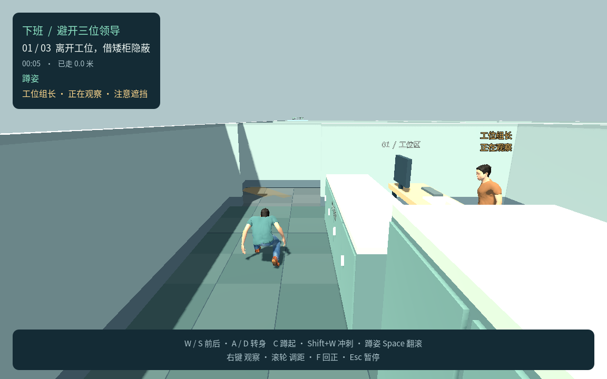
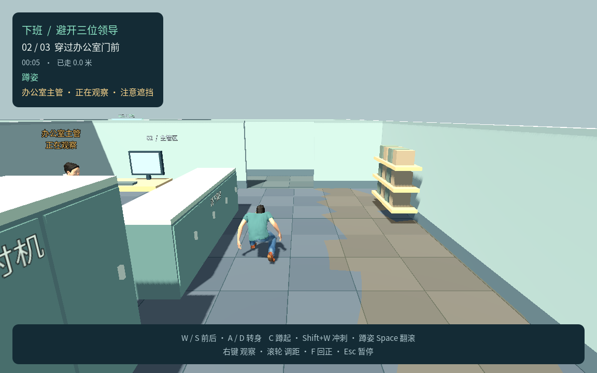
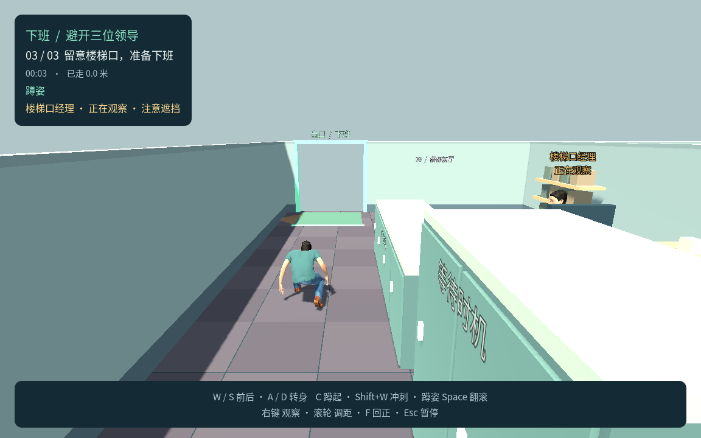

# P4b 三领导完整第一关：测试记录

更新日期：2026-09-22

状态：**P4b 三领导完整第一关已完成**。用户在 P4a 单领导小关完成后要求“继续完成后续的阶段性任务”；本轮据此接入第二、第三位领导并串成完整第一关。完整关卡引擎、原生画面与本机产物已验证，Chrome 完整交互基线 52 项通过，最终包另通过实载校验、完整键鼠通关，以及 13 项普通启动／真实本地嵌入定向复核。各轮证据分别记录，真实 itch.io 托管、Safari 与其他平台回归仍留在 P6。P4a 历史验收继续保留于 [P4 测试记录](P4测试记录.md)，不改其数字或用旧结果代替新验证。

## 本轮范围

- 默认场景 `game/scenes/p4b.tscn`，Web 端口 8771，版本 `0.6.0-p4`；P1～P3 与 P4a 单领导小关保留独立入口。
- 工位区、主管区、楼梯前厅共三段，通过两段交替转向的走廊连接；每段有站立可等待的高柜与需蹲行利用的矮柜。
- 工位组长、办公室主管、楼梯口经理各有独立身份、配色、办公朝向、自然观察方向、周期与开局进度。均为固定站立办公样板，无巡逻或追逐。
- 三位领导分别判断真实头胸视线和声源距离；声音本身不失败，翻滚安静但可被看见；不共享声源或发现状态。
- 任一领导确认发现后立即失败并标明发现者；暂停冻结全部角色与独立计时，重试清空动作、声源和发现状态并恢复各自初始节奏。
- 复用同一已授权人形、骨架和程序化上身姿态；实例配色与标签用于当前识别，P5 四种正式外观与 P6 完整发布回归未完成。

### 路线与试玩参数

| 区域／领导 | 世界位置 | 办公／观察时长 | 开局已办公时间 | 自然观察方向 |
|---|---|---|---|---|
| 工位组长 | `(9.3, 0, 29.0)` | 4.8 / 2.0 秒 | 0 秒 | 保持办公朝向，朝向左侧通路 |
| 办公室主管 | `(15.2, 0, 18.5)` | 5.6 / 2.5 秒 | 1.1 秒 | 从朝北办公方向转向右侧通路 |
| 楼梯口经理 | `(9.3, 0, 6.7)` | 4.2 / 2.2 秒 | 2.0 秒 | 从朝南办公方向转向左侧通路 |

开局进度只影响首次工作阶段；后续每轮使用完整办公时长，重试恢复同样进度。共用抬头 0.7 秒、低头 0.5 秒、连续可见确认 0.35 秒、声源观察 2.0 秒、视距 7.5 米和水平视角 100°；当前冲刺声音半径 8 米，重新遮挡立即清空未完成确认。这些均为可调试玩参数，不冒充用户逐项最终确认。

出生点 `(5.5, 0.05, 35.0)`，出口区域为 x=4.45～6.55、z=0.65～2.35。路线先沿左侧经过工位区，再穿走廊至右侧主管区，之后转回左侧楼梯前厅。高柜 1.95 米、矮柜 1.18 米；开放桌底禁止行走但不凭空成为视觉墙，实际桌面、桌腿与设备分别遮挡视线。

## 引擎与几何验收

环境：Godot `4.7.2.stable.official.ed1daf0bf`，macOS，Compatibility。

```bash
bash tools/godot.sh --headless --fixed-fps 60 --script res://tests/p4b_test.gd
```

正式套件 **69 项通过，0 项失败**，日志 `/tmp/xiaban-p4b-check.log`，末行 `P4B_TEST_RESULT passed=69 failed=0`。

| 范围 | 已验证结果 |
|---|---|
| 三位领导与办公节奏 | 三个独立人形、身份与时钟；各自到达正确观察方向，各段有真实遮挡的等待点 |
| 三段真实矮柜 | 同一点站立头胸可见、蹲下隐藏、重新站起恢复可见 |
| 三张办公桌 | 实际桌面遮挡视线；桌腿间空隙透视但禁止钻桌通行 |
| 独立听觉 | 在每段用真实移动冲刺触发声音，只有范围内领导反应，远处领导不接收声源；查看记录位置且不追逐 |
| 区域隔墙 | 不会隔着其他办公区域的不透明隔断看见玩家 |
| 独立失败 | 每位领导有短暂确认后以正确身份触发一次失败，冻结所有角色并清空输入 |
| 生命周期 | 暂停冻结独立计时、姿态和进度；继续恢复原状态，失焦暂停全部角色；菜单与重试清空旧状态 |
| 胜负优先级 | 分别检查三位领导在玩家同次更新进入出口时，确认发现优先于成功 |
| 完整物理路线 | 默认 AI 全程运行，通过蹲行、转身、等待和三次安静翻滚走过全部走廊并通关 |

完整路线使用真实 `InputMap` 操作玩家：C 蹲下、W/A/D 移动和转身、Space 翻滚，每段先在高柜等待观察结束后进入矮柜通路，到柜端再次等待后翻滚；从正常新游戏开始，途中不传送、不冻结领导、不改 AI 参数。游戏时间 **105.850 秒**、实际距离 **58.475 米**，无冲刺声音；成功后所有领导冻结，重新开始回到第一段。它验证实际物理控制器与 AI 闭环，仍不替代浏览器键鼠、捕获和渲染检查。

同一套件中的独立几何、声音与胜负顺序用例会明确摆位或调整计时以隔离条件；这些用例不计作默认难度的实际通关。

本轮共享领导脚本修改后，已实际重跑 P4a 引擎回归：**41 项通过，0 项失败**，日志 `/tmp/p4b-guard-regression.log`。这是本轮兼容性回归，不计入 P4b 正式套件。

临时独立配置检查 `/tmp/p4b_guard_config_test.gd`：**24 项通过，0 项失败**，日志 `/tmp/p4b-guard-config.log`。验证三个实例的身份、独立衬衣材质、开局进度、不同自然观察方向、收势归位、重试恢复，以及同一声音仅影响范围内实例。该检查不计入正式套件。

提示仍为采样引导，实际视觉每个物理帧检查；实际可见性变化立即重建提示，正常提示在各自的 150 毫秒时间网格刷新。临时空场景 CPU 探针同时重建三个提示 120 次，批次平均 1.964 毫秒、P95 1.991 毫秒、最大 2.001 毫秒，日志 `/tmp/p4b-guard-performance.log`。这只测射线和提示网格构建，不能解释成完整关卡帧率或浏览器性能。

## Chrome 真实输入验收

```bash
node tools/test_browser_p4b.cjs
```

Chrome **149.0.7827.54** 后台全套检查：**52 项通过，0 项失败**，报告 `.logs/p4b-browser/report.json`。该轮启动与最后一次墙牌调整重新导出相邻，报告只记录 Node 预取包摘要，未记录 Chrome 实际收到的 PCK 摘要。因此只将它记作完整交互基线，不宣称 52 项均运行在下节最终 PCK 上。最终包定向复验另列。

```bash
node tools/test_browser_p4b.cjs
P4B_FINAL_ONLY=1 node tools/test_browser_p4b.cjs
P4B_SMOKE_ONLY=1 node tools/test_browser_p4b.cjs
```

默认 `http://127.0.0.1:8771/` 与后台 Chrome；`P4B_URL` 更改地址，`P4B_HEADLESS=0` 开启独立有界面窗口。第二条命令将最终包路线定向检查保存到 `.logs/p4b-browser-final/`；第三条将普通入口与嵌入检查保存到 `.logs/p4b-browser-smoke/`，与全套结果分开。验收仅使用真实键鼠控制；`?p1_qa=1&p3_qa=1&p4b_qa=1` 增加只读诊断，不提供传送、冻结领导或修改游戏状态的入口。

| 全套基线范围 | 实际结果 |
|---|---|
| 完整三段路线 | 在每段观察、蹲行、等待办公间隙并安静翻滚，共三次翻滚、三段右键环绕观察，穿过两条连接走廊后抵达出口；游戏时间 105.85 秒，实际距离 58.428 米 |
| 三位分别发现 | 分别通过真实键鼠走到对应矮柜后、蹲下隐藏，再原地站起，三位领导均独立触发正确姓名的失败；每次结算冻结全部角色并清空输入 |
| 声音反应 | 第一段真实冲刺只让附近组长抬头看记录声源，隔高柜未能看见玩家；远处领导无共享声源，反应结束后恢复办公 |
| 暂停与继续 | Esc 冻结三位独立时钟、头部姿态与玩家；继续恢复原进度和捕获；切换浏览器标签页暂停四个角色 |
| 重试与菜单 | 每次失败及成功后重试清空动作、声音、发现进度、位置和各自计时，能返回菜单 |
| 普通 URL | 无诊断状态桥，Enter 开始并维持捕获，Esc 暂停释放鼠标 |
| 本地 iframe | 允许捕获时可开始和暂停；拒绝捕获时安全暂停全部角色且菜单可用 |
| 运行错误 | 无意外脚本或 WebGL 错误，Chrome 与游戏标签页未崩溃 |

完整场景的帧间隔样本在三个办公 AI 均活动时记录：8.0166 秒、481 帧，约 **60.00 FPS**，P95 **16.8 毫秒**、最大 **17.7 毫秒**。这是当前机器与后台 Chrome 的短时采样，不能当作所有设备或场景的最低性能承诺；最后墙牌调整后的样本另列最终包复验。

拒绝捕获 iframe 有意产生两条 `allow-pointer-lock` 权限错误，作为预期结果单独记录；缺省站点图标的 404 不计作游戏脚本错误。其他运行错误仍独立检查。后台 Chrome 未验证原生窗口切换、Safari、真实桌面全屏或人耳感知的脚步响度；本地 iframe 不替代 itch.io 托管验收。

### 最终包定向复验

最终 PCK 的完整真实输入路线已经通过，证据位于 `.logs/p4b-browser-final/report.json` 及 `chrome-loaded-builds.json`。Chrome 实际收到的 `index.pck` 响应为 14,681,016 字节，SHA-256 为 `0f12be7e9d4fb331336439345feaef46ec764490aaf9286570682b715f4b54e7`，与 Web、ZIP 和 macOS 最终产物一致。

该次报告记录 **19 项通过、2 条失败记录**：核心路线、三段观察与翻滚以及最终包响应校验均通过，随后普通 URL 的 Enter 输入早于游戏就绪，产生一个断言失败及其捕获记录。保留原始报告，不将它改写成整轮零失败。普通入口按等待 `P4B_READY` 和加载界面消失的条件另做定向复验；最终结果为 **13 项通过，0 项失败**，详见下表。旧报告中的提前输入失败已由这次正确等待加载的复核解决，不表示当前脚本仍失败。

最终路线用真实键鼠先在每段高柜观察、等低头，再进入矮柜通路，柜端再次等待并对齐后翻滚；完整经过三位领导与两条连接走廊。游戏时间 **144.167 秒**，实际距离 **58.653 米**，三次翻滚，噪声为 0，三位领导均未确认发现；终点进入成功结算。

最终包的三位 AI 活动场景采样 8.0167 秒、479 帧，约 **59.75 FPS**，P95 **17.6 毫秒**、最大 **50.0 毫秒**。这是同机后台 Chrome 的短时帧间隔数据，保留偶发长帧，不用平均值隐去抖动。

最终定向报告 `.logs/p4b-browser-smoke/report.json`，日志 `/tmp/p4b-final-smoke.log`，退出码 0。iframe 通过临时 `127.0.0.1` HTTP 服务的真实 HTML 宿主页加载，不拦截 Godot／WASM 响应，也不靠 `about:blank` 注入文档。之前测试宿主导致的 Secure Context／WASM 请求诊断问题已解决，最终报告无意外错误、无浏览器崩溃、无非关闭网络失败。

| 最终包定向检查 | 实际结果 |
|---|---|
| 普通 URL | 无诊断状态桥；Enter 与真实鼠标点击开始均保持捕获；Esc 暂停释放鼠标 |
| 允许捕获的本地 iframe | 三位办公逻辑正常启动，保持鼠标捕获，可暂停全关 |
| 拒绝捕获的本地 iframe | 四个角色安全暂停，能够返回可用菜单 |
| 实际加载一致性 | 普通 Enter、普通点击、允许和拒绝 iframe 共四页的 Chrome PCK 响应字节数与 SHA-256 全部与最终产物一致 |
| 错误与网络记录 | 无意外脚本／WebGL／网络错误，无浏览器或标签页崩溃；仅拒绝捕获场景产生两条预期权限错误 |

该轮 13 项只证明表内最终包定向场景；它与全套交互基线 52 项、最终路线 19 个已通过核心检查分别记录，不相加冒充一次最终包全套运行。真实 itch.io 页面、Safari、系统全屏和其他系统仍待 P6 验证。

路线复核确认两处输入要求：高柜到矮柜的过渡需要等待低头，Space 前需用 A/D 摆正人物朝向，否则锁向翻滚可能撞柜。测试只调整真实键鼠时机与朝向，未修改生产 AI、碰撞或发现规则；首次过渡暴露的轨迹和截图保留在 `.logs/p4b-browser-final/route-attempt-before-wait.json` 及同名 PNG。

## 原生画面与本机启动

Apple M4 的 Compatibility 渲染采样 **7 张原生画面**并已目检：菜单、三个区域的真实蹲姿掩体、楼梯口经理发现结算、连接走廊与出口。日志 `/tmp/p4b-visual.log`，状态清单 `.logs/p4b-visual/manifest.json`。

```bash
bash tools/godot.sh --fixed-fps 60 --resolution 1152x720 --script res://tests/p4b_visual.gd -- --output=/tmp/xiaban-p4b-visual
```

此脚本明确摆放角色、为拍摄冻结姿态，并关闭拍摄窗口失焦干扰；出口结算画面也由拍摄脚本设置。它只比较构图、真实骨骼姿态、家具与遮挡，不算真实输入通关或系统失焦验证。







最终 macOS 应用已在 Apple M4、OpenGL 4.1 实际启动，输出 `P4B_READY leaders=3 platform=macOS`，退出码 0；日志 `/tmp/p4b-export-launch.log`。启动成功不扩大为其他系统或外部分发验收。

## 本轮产物

```bash
bash tools/godot.sh
bash tools/build_web.sh p4b
python3 tools/serve_web.py --directory builds/p4b-web --port 8771
bash tools/godot.sh --headless --export-release 'macOS P4 Full' ../builds/macos/XiabanP4Full.app
```

| 产物／预设 | 目标位置或配置 |
|---|---|
| Web 场景 | `game/scenes/p4b.tscn`，`p4b` 特性，版本 `0.6.0-p4` |
| Web 预设 | `Web P4 Full` |
| Web 入口 | `builds/p4b-web/index.html`，本地端口 8771 |
| Web ZIP | `builds/xiaban-p4b-web.zip` |
| macOS 预设 | `macOS P4 Full`，版本 `0.6.0` |
| macOS 应用 | `builds/macos/XiabanP4Full.app`，Universal、本地 ad-hoc 签名 |

构建核对记录：`.logs/p4b-build-check.json`。

| 核对项 | 实际结果 |
|---|---|
| Web ZIP | 24,843,184 字节（23.69 MiB） |
| ZIP SHA-256 | `47568c65c38e4fde53ce658af818733b91f541b618547d72772c09e39a72129f` |
| 压缩完整性与许可 | 完整性通过；根目录入口及 Godot、字体、人物许可齐全 |
| PCK | 14,681,016 字节；Web、ZIP 内与 macOS 应用内完全一致 |
| PCK SHA-256 | `0f12be7e9d4fb331336439345feaef46ec764490aaf9286570682b715f4b54e7` |
| macOS 严格签名 | `codesign --verify --deep --strict` 通过 |
| 原生启动 | Apple M4 实际 GPU 启动、正确三位领导入口、退出码 0 |

未做 Apple 公证，未创建或发布 itch.io 页面；Safari 完整交互、真实托管及其他系统仍未验，不将后台 Chrome 或本地 iframe 扩大为这些平台通过。
