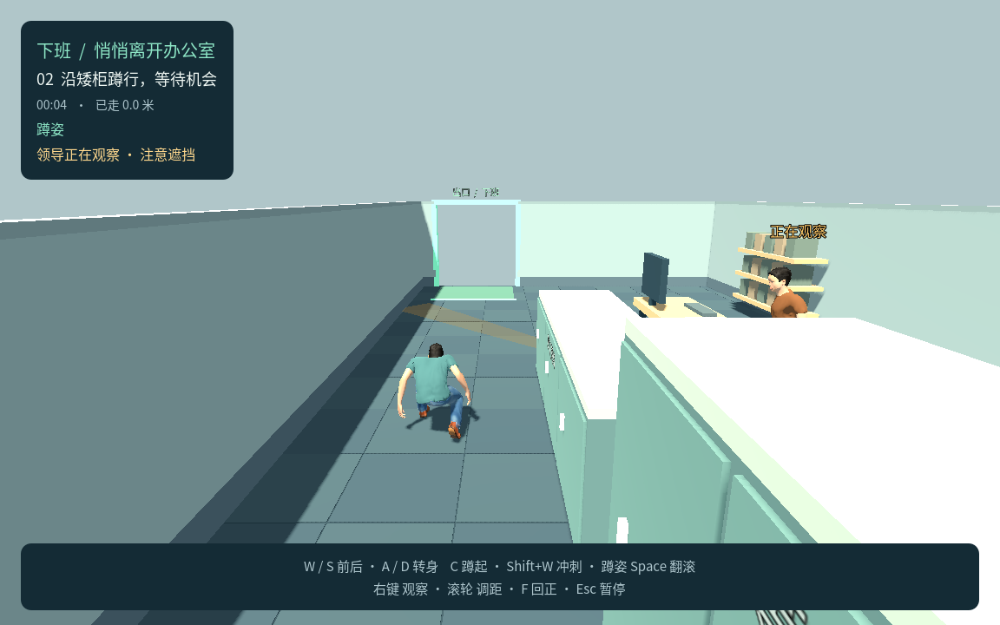
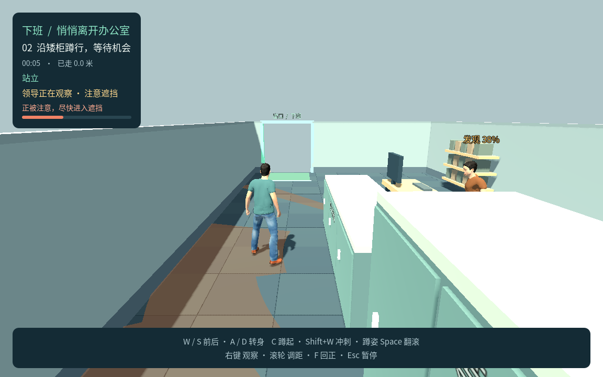

# P4a 单领导潜行小关：测试记录

更新日期：2026-09-22

状态：**P4a 单领导小目标已完成并通过验收**。用户已授权先完成一位办公领导、掩体通路、成功／发现失败和重试。P4 后半的第二、第三位领导与完整第一关尚未实施。

## 本轮范围

- 默认场景 `game/scenes/p4.tscn`，保留 P1～P3 独立入口；本地浏览器端口 8770。
- 玩家沿左侧通道，从高柜观察点经过矮柜，到达绿色门口。高柜遮挡站姿；同一矮柜位置站立露出、蹲下隐藏。
- 一位站立办公领导，固定位置与办公节奏；低头不观察，抬头有提前线索，仅观察阶段检查玩家真实头胸骨骼与三维遮挡。
- 冲刺声引起朝记录声源的注意；听到声音本身不判失败，翻滚安静但可被看见。无追逐。游戏内只有一位领导，测试另建独立实例检查感知状态不共享，不等于已经制作第二位领导。
- 看见并经过短暂确认后立即失败；重新遮挡立即清空未完成确认，暂停冻结双方动作与计时，重试恢复初始状态。
- 领导复用既有人形的独立实例配色和程序化上身姿态，没有新增外部角色或动画资产。该表现不代表正式四人外观完成。

试玩默认：办公 4.0 秒、抬头 0.7 秒、观察 2.2 秒、低头 0.5 秒，连续可见确认 0.35 秒；听觉半径来自 P3 冲刺事件，当前 8 米，抬头后查看记录声源 2.0 秒。视距 7.5 米、水平视角 100°。这些值和遮挡清空策略均可调整，不冒充用户逐项最终确认。

## 引擎验收

环境：Godot `4.7.2.stable.official.ed1daf0bf`，macOS，Compatibility，固定 60 FPS 的无窗口引擎检查。

```bash
bash tools/godot.sh --headless --fixed-fps 60 --script res://tests/p4_test.gd
```

最终代码引擎复验：**41 项通过，0 项失败**，日志 `/tmp/xiaban-p4-test.log`，末行 `P4_TEST_RESULT passed=41 failed=0`。

| 范围 | 已验证行为 |
|---|---|
| 真实掩体 | 同一点站立可见、蹲姿头胸被矮柜遮挡、站回恢复可见；隐藏时不累计确认 |
| 实际桌面与开放桌底 | 桌面遮挡视线；桌腿之间的空隙可透视，行走仍不能穿桌 |
| 视距、角度与三维射线 | 背面、超距离和薄墙阻挡；头露出而胸被挡时仍可见 |
| 办公周期 | 低头不检测且无有效视野提示；抬头姿态有变化、之后才启用观察；低头恢复工作 |
| 短暂确认 | 短曝光累计但不立即失败；遮挡清空，第二次曝光不继承；持续可见只触发一次失败 |
| 声音注意 | 范围外无反应；范围内抬头看记录声源，声音本身不失败；连续脚步不重启过渡，不追踪藏住的玩家；独立实例不共享声源 |
| 翻滚 | 真实翻滚头胸仍参与视觉判定，安静不提供视觉无敌 |
| 暂停与重试 | 玩家、领导、姿态和计时冻结；继续不重放旧输入；失焦暂停，菜单／失败／成功后的重试清空旧状态 |
| 胜负顺序 | 发现与出口同次更新时发现优先；未发现到门口成功并冻结领导 |

上述引擎摆位检查不能代替真实键鼠走完路线。

另有视线提示定向复验 **5 项通过，0 项失败**，日志 `/tmp/p4-fan-refresh.log`：站起或蹲下使真实可见性变化时，地面提示在同一物理帧重建，不能等原有 150 毫秒刷新周期才追上发现判定。此定向结果不计入 41 项。

本轮实际重跑 P3 控制回归，**72 项通过，0 项失败**，日志 `/tmp/xiaban-p3-p4-regression.log`。P1／P2 与 P3 接地、独立姿态空间的旧数字仍属于各自历史记录，本页未冒充这些套件已在本轮全部重跑。

## 独立关卡几何检查

对 `p4_level.gd` 运行临时 `/tmp/p4_level_check.gd`，**9 项通过**，日志 `/tmp/p4-level-check.log`。其中五项检查桌下视线、桌面视线、桌下行走阻挡、出生点与掩体点可走；四项射线检查矮柜后站立暴露／蹲姿隐藏、高柜后声音测试点和出生点遮挡。

- 出生点 `(5.5, 0.05, 14.0)`，矮柜对照点 `(5.5, 0, 8.8)`。
- 声音测试点 `(5.5, 0, 13.5)`，从领导处约 6.28 米，能听见且确实被高柜挡住；不使用会落入柜间视线间隙的旧点。
- 矮柜高 1.18 米、高柜高 1.95 米，行走、镜头及视觉层与实心几何对应。
- 视觉家具使用专用碰撞层 16；桌下整体行走碰撞只在层 1，实际桌面、四条腿和设备才进入视觉层。人物层 8 单独参与视觉阻挡。

该临时几何检查独立于正式引擎套件，不将 9 项计入 41 项。原生关卡概览 `/tmp/p4-level-overview.png` 已查看；它只检查布局，不能代替下面的角色实机画面。

## 原生画面

最终代码在 Apple M4 的 Compatibility 渲染中采样 **6 张原生画面**，菜单、出生观察点、蹲姿办公、蹲姿观察、站起暴露与发现结算已目检；清单与状态在 `.logs/p4-visual/manifest.json`。

```bash
bash tools/godot.sh --fixed-fps 60 --resolution 1152x720 --script res://tests/p4_visual.gd -- --output=/tmp/xiaban-p4-visual
```

该脚本是固定场景拍摄，允许摆放玩家以对照姿态，并关闭该拍摄窗口的失焦干扰；不计作不用传送的真实路线通关或原生窗口失焦测试。实际游戏失焦逻辑由独立引擎检查和浏览器验收覆盖。

同一柜后位置，蹲下时头胸被挡，观察已经开启但确认进度为零；站起后身体露出，进入短暂确认。以下是原生摆位对照，非浏览器输入截图。





## Chrome 最终包验收

Chrome **149.0.7827.54**，后台模式，**30 项通过，0 项失败**。受测 PCK 的 SHA-256 与下节 Web／ZIP／macOS 最终包精确一致。

```bash
node tools/test_browser_p4.cjs
```

默认后台 Chrome 与 `http://127.0.0.1:8770/`；`P4_HEADLESS=0` 启用独立可见窗口，`P4_URL` 可指定其他地址。依赖来自 `.tools/browser-qa/`。测试只通过真实键鼠操作游戏，`?p1_qa=1&p3_qa=1&p4_qa=1` 提供只读状态；不传送、不冻结领导、不写入游戏状态。

报告位于 `.logs/p4-browser/report.json`，测试包哈希在 `tested-build.json`；同目录保存截图、`discovery-frames.json` 与 `route-frames.json`，重复运行覆盖同名结果。最终发现、翻滚和通关截图已目检。

| 范围 | 最终结果 |
|---|---|
| 完整潜行路线 | 真实键鼠观察并等待办公间隙，C 蹲行，Space 安静翻滚 2.4 米后抵达绿色出口；游戏计时约 14.0 秒、实际移动约 11.655 米、噪声 0 |
| 直接暴露失败 | 从起点一直按 W 会在出口前被发现；说明需要实际利用潜行时机 |
| 同位置姿态对照 | 矮柜后 C 蹲下可持续躲过观察，原地站起露出身体并累计确认后失败 |
| 声音反应 | 高柜后真实冲刺触发抬头，领导查看记录声源且不能隔高柜看见玩家，随后回到工作；声音本身不失败 |
| 暂停与恢复 | Esc 冻结抬头姿态、双方计时与玩家动画；明确继续恢复原进度和鼠标捕获；真实切换浏览器标签页会暂停双方并释放捕获 |
| 重试与菜单 | 失败和成功后均可重试，清空动作、声源、确认和位置，能够返回菜单 |
| 普通 URL | 未暴露诊断桥；Enter 开始并维持捕获，Esc 暂停释放鼠标 |
| 本地 iframe | 允许捕获时可开始和暂停；拒绝捕获时安全暂停，双方冻结且菜单可用 |
| 运行错误 | Chrome 与页面无崩溃、无意外脚本或 WebGL 错误 |

拒绝鼠标捕获的 iframe 有意产生两条 `allow-pointer-lock` 权限错误，报告单独记录为预期结果；未过滤其他运行错误。后台运行没有验证原生系统窗口切换、Safari、真实桌面全屏或人耳感知的脚步响度。原生画面由上节单独检查，不能把浏览器报告扩大为这些项目通过。

## 最终产物与本机启动

已生成 P4a Web 和 macOS 产物，构建核对数据保存在 `.logs/p4-build-check.json`：

| 项目 | 实际结果 |
|---|---|
| Web ZIP | `builds/xiaban-p4-web.zip`，24,826,962 字节（23.68 MiB） |
| ZIP 完整性 | 压缩内容校验通过，根目录 `index.html`，Godot、字体与人物许可三个文本齐全 |
| PCK | 14,663,392 字节；Web、ZIP 内与 macOS 应用内完全一致 |
| PCK SHA-256 | `2f6443d77b2ac1977a98b973e91a1f553491e21b5656eb442c3de40ded6c7cba` |
| macOS | `builds/macos/XiabanP4.app`，Universal、0.5.0，本地 ad-hoc 签名 |
| macOS 严格签名 | 校验通过；未做 Apple 公证 |
| 原生实际启动 | Apple M4 GPU 启动打印 `P4_READY`、正常退出 0，日志 `/tmp/xiaban-p4-export-launch.log` |

## 入口与产物

```bash
bash tools/godot.sh
bash tools/build_web.sh p4
python3 tools/serve_web.py --directory builds/p4-web --port 8770
bash tools/godot.sh --headless --export-release 'macOS P4' ../builds/macos/XiabanP4.app
```

浏览器地址：[P4a 本地试玩](http://127.0.0.1:8770/)。Web 目录 `builds/p4-web`，ZIP `builds/xiaban-p4-web.zip`，特性 `p4` 和版本 `0.5.0-p4a`；macOS 预设 `macOS P4`，应用 `builds/macos/XiabanP4.app`，版本 `0.5.0`。

当前没有公开上传 itch.io；Safari、真实托管环境与其他系统未验。不将本机启动、后台 Chrome 或本地 iframe 检查扩大为这些平台支持声明。
