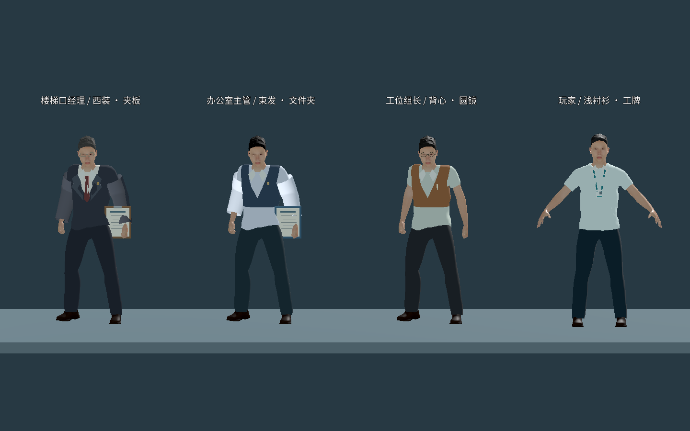
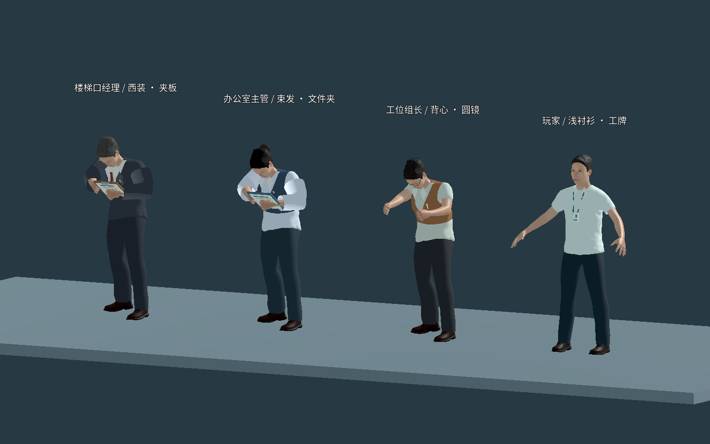

# 人物模型与动画资源选型

更新日期：2026-09-23。当前默认为正式第一关 `release.tscn`、版本 `1.0.0`。**P5 完成，P6 本地交付完成，实际 itch.io 托管待账号或页面。** 基础成人与六段动画来自 P2，控制沿用 P3，三领导路线与感知沿用 P4；四人衣着／配饰与三种办公动作已完成最终画面检查。正式引擎 92／92、Chrome 整关 67／67 及 macOS 构建验证通过；Safari 26.6.2 仅完成真实 UI 烟测。交付证据见 [P5–P6 交付测试记录](P5-P6交付测试记录.md)，历史结果见 [P2](P2测试记录.md)、[P3](P3测试记录.md) 和 [P4 完整关卡记录](P4完整关卡测试记录.md)。

## 当前采用的组合

目标是成人比例、能辨认头脸、四肢、衣鞋和头发的人类角色。P2 先验证一个共用骨架样板，P4b 扩大到玩家与三位领导的独立实例；正式 release 在同一骨架上生成四种衣着和配饰，并加入不同办公姿态。

| 部分 | 实际使用 | 处理记录 |
|---|---|---|
| 人体与骨架 | MPFB 2.0.17／MakeHuman，CC0 图形资产 | 约 1.75 米成人、53 根骨骼，统一尺寸、朝向和脚底基准 |
| 衣物与外观 | MakeHuman 官方 CC0 系统包中的衣服、鞋、短发、眉毛、眼睛和皮肤 | 基础 GLB 为一个着装成人：6 个网格、19,069 三角面、7 个材质与 8 张最大 1K 纹理；不包含运行时新增外观 |
| 动画 | Quaternius Universal Animation Library **Standard-1.0**，CC0 | 从作者在 Godot 官方资产商店提供的免费包取得，六段动作重定向到同一成人骨架 |
| 编辑与运行资产 | `art/characters/office_worker.blend`、`game/assets/characters/office_worker.glb` | Blender 工程保留编辑来源；GLB 用于 Godot，处理记录存于同目录 `office_worker.json` |
| 正式外观与办公动作 | `game/scripts/release_character.gd`、`game/scripts/release_guard_visual.gd` | 项目原创服装裁切分色、袖子与配饰、文件夹／夹板及办公动作层；基础人体与动画来源不变 |
| 场景与控制 | 当前 `game/scenes/release.tscn`，P2／P3／P4a／P4b 独立场景保留 | 正式版沿用 P3 控制与 P4b 路线，新增表现需单独最终验收；P2 数字键预览不属于正式操作 |

人体工具来自 [Blender 官方 MPFB 页面](https://extensions.blender.org/add-ons/mpfb/)，许可依据 [MPFB 2.0.17 说明](https://github.com/makehumancommunity/mpfb2/blob/v2.0.17/LICENSE.md)及 [MakeHuman 官方系统素材页](https://static.makehumancommunity.org/assets/assetpacks/makehuman_system_assets.html)。插件代码的许可与图形资产许可分别处理，插件程序代码不作为游戏素材分发。具体项目与修改记录见 [素材授权](素材授权.md)。

动画实际下载页是 [Godot 官方资产商店的 Quaternius 页面](https://store.godotengine.org/asset/quaternius/universal-animation-library/)，版本标签为 **Standard-1.0**。它与作者 [itch.io 页面](https://quaternius.itch.io/universal-animation-library)上的较新版本不是同一份下载；不将较新版本号或广告动作总数套用于本次资源。取得的包实际有 46 段动画，P2 选择六段；未购买付费版本，也未依赖 Mixamo。

## 正式第一关的四人表现

| 角色 | 当前外观 | 动作与道具 |
|---|---|---|
| 玩家 | 浅色衬衫领短袖、青色挂绳工牌、深蓝长裤 | 沿用六段基础移动动画及完整蹲起／冲刺／翻滚控制 |
| 工位组长 | 棕色针织背心、圆框眼镜、灰棕短发、口袋笔 | 站立敲键盘，抬头时收回工作姿态 |
| 办公室主管 | 蓝色马甲、七分袖、低束发结、领针 | 持蓝文件夹翻阅，独立转头观察 |
| 楼梯口经理 | 深灰西装长袖、翻领、酒红领带、方镜、银灰短发 | 持夹板记笔记，独立抬头观察 |

衣身使用连续底模表面的裁切分色，袖子、眼镜、领带、发结和工牌等采用低面数几何附件。头发保留原有几何和透明裁切纹理，使用角色私有的色阶处理；不直接覆盖共享材质影响其他人物。四人共用成人骨架，没有因此导入另一套人体、坐姿或巡逻动画。

办公动作层和文件夹、夹板、笔等为项目原创程序表现；低头／抬头的身体姿态、实际眼位及头胸视线保留 P4 规则。最终已检查四人服装、三种办公姿态、玩家动作和肩后镜头画面，修正初版服装叠加白斑及头皮穿插，并在最终衣装后重跑引擎测试。原生截图见下图；摆位渲染不能代替实际键鼠通关，也不构成所有中间帧绝无穿插的保证。

场景中的暖灰墙、木纹、地毯／地砖、导向牌及原创程序音效由正式关卡脚本提供；菜单／暂停的音量与灵敏度保存不修改角色资源或 AI 规则。新增原创表现与基础 CC0 资产分别记录于 [素材授权](素材授权.md)，未替整个仓库选择开源许可。

## 六段动作的实际映射

| 样板动作 | 项目名 | 实际源 clip | P2 操作与边界 |
|---|---|---|---|
| 站立待机 | `idle` | `Idle_Loop` | 1：原地待机，骨骼有呼吸等细微变化 |
| 行走 | `walk` | `Walk_Loop` | 2：原地展示；正常 W/S 使用此动画配合位移，倒退反向播放 |
| 跑步 | `run` | `Sprint_Loop` | 3：原地展示，不启用冲刺速度或声音 |
| 蹲姿待机 | `crouch_idle` | `Crouch_Idle_Loop` | 4：原地展示，不降低碰撞体 |
| 蹲走 | `crouch_walk` | `Crouch_Fwd_Loop` | 5：原地展示，不启用物理蹲走 |
| 翻滚 | `roll` | `Roll` | 6：原地展示，不产生翻滚位移 |

按 0 返回正常行走试玩。数字键只是样板选择器，不是已确认的 P3 最终动作键位。正常行走速度 1.65 米／秒是当前可调样板参数。

动画经过骨骼重定向、统一命名与脚底基准处理，不直接控制玩家 `CharacterBody3D` 或相机。引擎测试已确认六段动画实际改变骨骼姿态，而原地展示不改变玩家位置、朝向和站立碰撞高度。另用真实原生渲染的 16 张采样画面检查比例、衣物、膝肘与翻滚，修正不透明材质误用 alpha 混合导致的深度排序问题。翻滚首尾混合到蹲姿，骨架的接地修正不驱动玩家碰撞体；最终对短袖覆盖区身体面作精确遮蔽并保留裸露手臂，修正肩袖穿插；画面采样不代表对所有中间帧或最终外观的保证。

## P2 验收范围

- 一个成人具有真实蒙皮权重、有效骨架和六段带骨骼关键帧的动画，不用胶囊或整个人体刚性旋转代替。
- W/S 正常移动和动画方向相符，A/D 转身沿用 P1；倒退不让人物和镜头反向。
- 原地展示的骨骼持续变化，镜头不随蹲起或翻滚姿态升降、翻转；右键、F、滚轮和 Esc 仍可用。
- 暂停冻结动画时间与姿态，继续恢复当前预览，重试清除预览和残留输入。
- 目检成人比例、肩颈、膝肘、服装、脚底和循环，记录单个人形在 Mac／Web 的运行与包体。
- 记录资源作者、来源、版本、许可和修改，保留编辑工程与运行 GLB。

**P3 已完成并通过验收**：真实蹲姿碰撞、完整站起空间、站姿冲刺、动作声音事件、翻滚位移和完整动画碰撞空间、恢复与暂停重试。P2 原地蹲姿／翻滚保留站立碰撞体的历史样板边界不变；P3 已提供随骨骼变化的头胸采样点，领导视觉与听觉消费这些状态的逻辑在 P4a 单领导小关接入。P2 额外使用四个同模视觉副本测量渲染开销；它们不运行领导 AI。P4b 的完整潜行场景与四个同模实例已完成独立玩法与当前机器运行验证，见 [P4 完整关卡测试记录](P4完整关卡测试记录.md)。正式 release 四种外观、姿态和本机性能已单独检查，Chrome 整关与 macOS 构建验证通过；Safari 仅完成真实 UI 烟测，实际 itch.io 托管待账号或页面，范围见 P5–P6 交付记录。

## 资源复用与验证边界

继续使用经过验证的骨架及共享动作。增加衣服、发型或体型时逐件确认许可，并检查蹲、跑、滚的变形，不因角色外观不同就引入另一套骨架。

P3 完整控制由 `CharacterBody3D` 管理位移和碰撞，原地动画配合状态机，不叠加素材根节点位移。当前翻滚动画最高约 1.476 米；即使低姿胶囊只有 1.05 米高，也必须沿运动路径检查宽 1.06 × 高 1.55 × 长 2.20 米的完整动作包络，防止头、手、脚穿入低顶或墙面。P3 当前站立碰撞为 1.80 米，略高于约 1.75 米可见人形；尺寸和动作时间属于可调试玩参数。若后续使用 root motion，需重新设计位移与碰撞衔接。参考：[Godot glTF／GLB 格式](https://docs.godotengine.org/en/stable/tutorials/assets_pipeline/importing_3d_scenes/available_formats.html)、[骨架重定向](https://docs.godotengine.org/en/stable/tutorials/assets_pipeline/retargeting_3d_skeletons.html)。

可重建源文件、源动作与处理脚本说明见 [角色源文件](../art/characters/README.md)。资产样板结果见 [P2 测试记录](P2测试记录.md)，P3 动作控制的历史验收见 [P3 测试记录](P3测试记录.md)，正式交付结果见 [P5–P6 交付测试记录](P5-P6交付测试记录.md)，操作见 [运行与导出](运行与导出.md)。

P4a 复用同一人形与骨架，通过独立实例配色和程序化上身姿态表现站立办公、抬头与转头，不新增外部资产，也不改动 P2／P3 的导入资源。玩家检测点来自实际动画头胸骨骼，领导观察点跟随其头部；姿态通过与独立动作计时同步的程序控制冻结和恢复。P4a 单领导玩法样板已完成，该阶段尚不包含四种正式外观；办公姿态、遮挡与新包验收见 [P4 测试记录](P4测试记录.md)。

P4b 继续复用以上 GLB、骨架与程序化办公姿态，未新增外部素材、坐姿动画或巡逻动作。三个领导分别使用棕色、蓝灰色、灰紫色衬衣实例材质，并配有工位组长／办公室主管／楼梯口经理标签；独立材质避免修改其中一位影响其他角色。办公朝向、自然观察偏移、周期与初始进度独立配置，暂停和重试分别同步恢复。该策略只代表 P4b 当时的玩法与样板外观，不能证明 P5 新服装和身份表现已完成最终验收。P4b 历史画面与性能边界见 [P4 完整关卡测试记录](P4完整关卡测试记录.md)；当前正式版本以本页上方四人表现与 P5–P6 交付记录为准。
