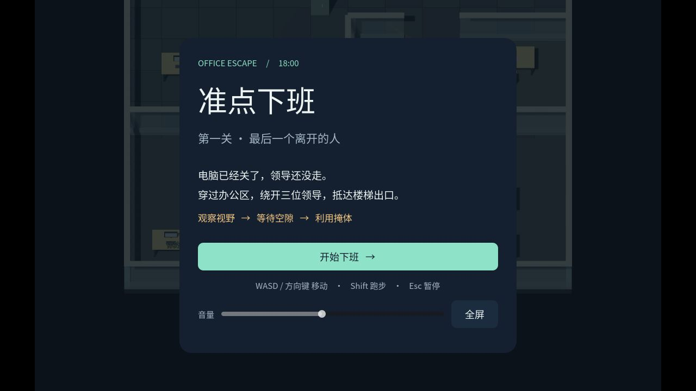

# 第一关 v0.1 测试记录

日期：2026-09-19 
工程：Godot 4.7.2.stable / GDScript / Compatibility 
开发系统：macOS / Apple M4

## 结论

第一关可玩原型已实现并完成技术回归、真实输入整关回放、Web 导出及浏览器渲染/界面检查。可独立开始、遇到危险、成功或失败并重试。
这不等同于完成外部玩家体验验收、全部浏览器兼容性或 itch.io 实际托管验收。

## 规则与物理回归

命令：`bash tools/godot.sh --headless --script res://tests/level_test.gd`。
最终 **45 项全部通过**，正常时钟退出码 0，无 ERROR/WARNING。证据在 `.logs/level-test.log`；测试脚本保留在工程中便于复现。

覆盖：

- 出生点静置安全、背后与距离外不被看到；高墙和隔断阻挡，站在矮桌后仍可见。
- 实际物理帧中的移动、斜向速度归一、跑步、停步、落地与撞墙。
- `InputEventKey` 物理键码映射：按住 W 24 帧移动 1.440 米，Shift+W 同期移动 2.080 米，松开后停止；不绕过实际按键映射。
- 独立物理球体扫掠检查导航路径，不仅调用导航自身的布尔判断来验证。
- L2 能经过办公室门洞往返，L3 能走到两端并转向。
- 警戒增长、进入追赶、失去目标后的搜索与返回。
- 暂停时位置、警戒和计时冻结，继续后恢复。
- 近距离抓捕要求已在追赶且无遮挡；未警觉时贴近背后不直接失败。
- 出口成功、抓捕失败、同帧捕获优先、只结算一次以及两种结算后的重试。

## 完整路线回放

命令：`bash tools/godot.sh --headless --fixed-fps 60 --script res://tests/playthrough.gd`。
证据：`.logs/playthrough.log`。仅发送游戏输入并等待；不传送玩家、不修改领导状态、不调用胜利方法。

| 回放 | 结果 | 观察 |
|---|---|---|
| 观察后通过 | 30.18 秒成功 | 等工位领导转回、办公室领导返程、楼梯领导转向；无追赶，L2 警戒峰值 71.7% |
| 已知路线全程跑步 | 10.68 秒成功 | L1 警戒到满并追赶，L3 峰值 85%；允许熟练玩家冒险跑过 |
| 同路直接步行 | 7.63 秒失败 | 被办公室领导抓住，证明危险与失败路径实际生效 |

这是熟练、已知路线的自动输入验证。尚未统计首次玩家用时、重试次数或趣味性。

## 导出与实际界面

| 项目 | 结果 |
|---|---|
| Godot 工程导入与启动 | 通过，场景和三个领导正常初始化，无脚本加载错误 |
| Web Release 导出 | 通过，单线程 WebGL 2 / Compatibility；Web ZIP 约 17 MiB |
| Chromium 内置浏览器 | 实际看到中文菜单、3D 办公室、人物、巡逻、被掩体截断的视野；控制台无 error/warn |
| 浏览器界面 | 实际点击开始、暂停、重试和返回菜单；重试后计时回零、场景恢复；Esc 可暂停/继续 |
| 小窗口 | 800×600 检查暂停面板与主要操作仍可见，保持比例留边；临时尺寸已恢复 |
| 全屏入口 | 实际看到进入全屏和按钮切回窗口；浏览器原生 Esc 退出全屏行为未作完整保证 |
| 原生 Chrome | 页面能加载并显示菜单；进一步原生窗口输入自动化报 noWindowsAvailable，未据此宣称完整人工通关 |
| Web 长按移动 | 自动化单次按键瞬间按下/松开，未可靠验证持续长按位移；通过引擎实际物理输入和物理键码映射测试补充证据 |
| macOS 独立应用 | Release 导出成功，签名验证通过，架构 arm64 + x86_64；图形启动 120 帧后退出 0，出现 LEVEL_READY |
| 音效 | 已加入原创合成脚步、警戒、开始及结算短音；不将无界面测试视为人耳音质验收 |
| 字体和许可 | Noto Sans SC 随包附带，Web 根目录有 OFL 完整文本及引擎许可链接 |

## 尚未验证

- Safari、真实 Windows 浏览器和其他设备；未声明这些环境已经受支持。
- 独立新玩家能否无需讲解理解规则、是否愿意重试及主观手感。
- 实际 itch.io 页面、嵌入尺寸及托管环境；当前未创建页面或上传。
- 禁止持久存储等浏览器特殊模式的全流程。设置保存失败不参与胜负逻辑，但仍需实际环境验证。
- Mac 应用窗口内完整人工操作；当前仅做本机图形启动，未完成对外分发所需公证。

## 本轮修正

1. 统一 Shift 跑步动作名，消除输入映射不一致。
2. 导航保留可通行的真实起终点，避免领导停在网格中心而无法切换巡逻点。
3. 捕获统一限制在追赶状态，且检查障碍物；同帧捕获优先，避免事件顺序改变结果。
4. 根据盲冲回放调整 L1 的初始朝向、视角、警戒时间与追赶速度，保留一条观察通关路线。
5. 测试退出时停音、释放场景并等待音频线程清理，避免加速测试立即退出造成残留对象警告。

## 截图与交付

- Web 包：`builds/office-escape-level-one-web.zip`。
- Mac 本机测试：`builds/macos/OfficeEscape.app`。
- 玩家说明：[第一关试玩说明](第一关试玩说明.md)。
- 上传文字：[itch 页面文案](itch页面文案.md)。
- 素材记录：[素材授权](素材授权.md)。
