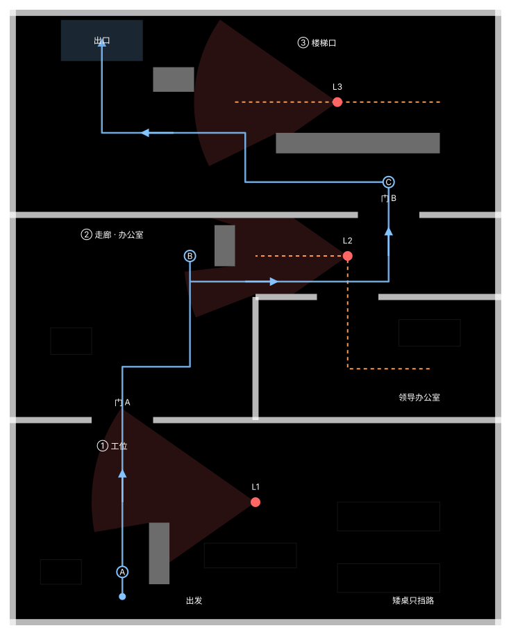

# 第一关设计：从工位到楼梯口

> 本页保留斜俯视 v0.1 的路线和地图底稿。2026-09-20 起改做右肩过肩第三人称，路线可复用，但通道、墙体、矮掩体与姿态视线需要调整，详见 [当前开发计划](../开发计划.md)。下文尺寸、操作与视野规则属于旧阶段，不直接作为新版验收依据。

版本：v0.1 草图提案 
日期：2026-09-19 
状态：本页保留 v0.1 布局依据；已在 Godot 实现并完成输入回放。实施参数与验证结论见文末及 [第一关测试记录](第一关测试记录.md)。

短期目标：完成一个玩家能独立开始、躲避领导、成功下班或失败重试的关卡。
沿用 [项目设定](../项目设定.md)；执行顺序见 [第一关任务清单](第一关任务清单.md)。
本页新增的尺寸、位置和巡逻安排属于初稿，须通过灰盒试玩调整，未视为用户逐项定稿。

## 1. 俯视草图

从下往上阅读：工位 → 左侧门 A → 办公室门前的走廊 → 右侧门 B → 楼梯口 → 左上出口。

- 实线：一条候选通关路线，包含停下观察与等待；不代表沿线一直跑就安全。
- 虚线：领导往返巡逻的路线。
- 扇形：领导处于某个位置、朝向时的静态视野示例；不是开局三人的真实同步状态。
- 深色长块：高柜或隔断，挡路且挡视线；浅色矩形：矮桌，只挡路。
- A / B / C：观察和等待的参考位置；不是无敌区域，追赶时领导仍可绕过掩体。

图中视野经过高掩体和墙体截断，但只是二维方案示意。游戏中的身体检测点、角色高度、掩体边缘和时间窗口仍要实测。

## 2. 玩家经历的三段挑战

| 区域 | 玩家看到什么 | 要做的判断 | 暴露后的选择 |
|---|---|---|---|
| ① 工位区 | 自己在隔断左侧，L1 在对面工位转头，出口方向在上方 | 在 A 观察朝向，趁领导看回工位时向左侧门移动 | 警戒未满时退回隔断；追赶后可绕桌尝试甩开 |
| ② 办公室与走廊 | L2 从办公室出来巡视，通向下一段的门在右上方 | 在 B 借高柜遮挡，等领导往回走，再绕柜经过走廊 | 退回柜后或左侧前厅；走廊被追时仍须靠真实遮挡脱离视线 |
| ③ 楼梯口 | 先看见长柜另一侧的视野或领导身影，左上方有出口标识 | 在 C 观察往返规律，沿长柜下方绕到左侧，抓住背向时机经过 | 回到长柜下方；不要在门口设置进入就必被抓的陷阱 |

第一段教会观察，第二段要求同时利用时间和遮挡，第三段综合运用前两段规则。
这里的楼梯口是平面区域，抵达出口触发成功，首版不做楼梯攀爬或多楼层。

### 三位领导的安排

- **L1 工位领导：**固定在工位旁，交替看向走道和自己的工作区；转头过程可见。警戒满后依然能追赶，丢失目标并结束搜索后回到工位。
- **L2 办公室领导：**从办公室内部出发，经敞开的门走到走廊，再原路返回；在端点短暂停留。只巡视一段确定路线，不随机改变行为。
- **L3 楼梯口领导：**在长柜上方往返，抵达端点时转身；让玩家在门 B 附近就能获得线索。初始位置与朝向要给首次到达者观察机会。

三人复用感知、警戒、追赶、搜索和返回逻辑；区别通过位置、转头方式、巡逻点和参数配置。
跑步首版只影响速度，不增加噪声侦测、体力或其他新规则。

## 3. 灰盒搭建参考

灰盒是用方块表示墙、桌、柜，用胶囊表示人物，先检验路线和操作。
初始占地暂按 **24 × 30 个世界单位**，搭建时可按 1 单位约 1 米理解；以角色手感与镜头为准调整。
图中左上为 `(0, 0)`，向右为 `x`，向下为 `z`；Godot 中地面高度为 `y = 0`。

| 内容 | 初始参考位置或范围（x, z） | 用途 |
|---|---|---|
| 工位区 | x 0～24，z 20～30 | 出发与第一段教学 |
| 办公室与走廊 | x 0～24，z 10～20 | 中段巡逻挑战 |
| 领导办公室 | x 12～24，z 14～20 | L2 起点；北侧门洞 x 15～18 |
| 楼梯口 | x 0～24，z 0～10 | 最后一段挑战 |
| 玩家出生 | (5.5, 28.6) | 在首块高隔断后开始 |
| 门 A | z 20，x 4～7 | 从工位区进入中段 |
| 门 B | z 10，x 17～20 | 从走廊进入楼梯口 |
| 出口区域 | x 2.5～6.5，z 0.5～2.5 | 平面通关触发区 |
| A 观察点 | (5.5, 27.4) | 观察 L1 转头 |
| B 观察点 | (8.8, 12) | 在竖直高柜左侧观察 L2 |
| C 观察点 | (18.5, 8.4) | 在长柜下方观察 L3 |

### 掩体与巡逻参考

| 对象 | 初始参考 | 说明 |
|---|---|---|
| 工位高隔断 | x 6.8～7.8，z 25～28 | 遮挡 L1 对出生点的视线 |
| 走廊高柜 | x 10～11，z 10.5～12.5 | 玩家从下侧绕行；重点实测通道宽度 |
| 楼梯口长柜 | x 13～21，z 6～7 | 可用数个相邻柜子组成，提供观察与绕行空间 |
| 出口附近高柜 | x 7～9，z 2.8～4 | 提供末段局部遮挡 |
| L1 初始位置 | (12, 24)，初始看向自己的桌面（+z） | 周期性转向左侧走道（−x） |
| L2 初始位置与路线 | (20.5, 17.5) → (16.5, 17.5) → (16.5, 12) → (12, 12)，原路返回 | 初始沿首段朝 −x；穿过办公室北侧门洞 |
| L3 初始位置与路线 | (16, 4.5) 先朝 +x 走到 (21, 4.5)，之后在 (11, 4.5) 与 (21, 4.5) 间往返 | 出门即被发现的情况须通过实际时序检查 |

墙、高柜和隔断必须高于视觉检测线；矮桌高度不能遮住站立角色的身体检测点。
原型可先用约 0.35 单位的角色碰撞半径检查通行，后续按手感调节；导航网格也须为领导留出半径。
门洞暂为 3 单位宽，避免第一版依赖极窄缝隙。
草图扇形使用 70°、7～8 单位距离来展示空间关系，不是已验证的游戏参数。

## 4. 必须通过原型验证的问题

1. **出生保护。**默认状态下原地不动应能安全阅读提示；新手第一次移动不应立即失败。
2. **能否真正通关。**关闭调试作弊，至少实玩一次完整成功路线；草图连通不等于实际可避开领导。
3. **能否无脑直冲。**尝试不观察一路跑到出口。若稳定绕过所有挑战，调整巡逻覆盖、掩体或布局，同时保留正常等待后的可行路线。
4. **走廊可走、可追。**B 柜下侧与办公室墙之间既要容纳玩家，也要让领导合理绕路；不能靠导航失败保护玩家。
5. **视野可信。**以墙角、柜边、门洞和矮桌为重点，核对地面显示与真实感知。
6. **楼梯口有预警。**进入门 B 前后能看到领导、危险视野或清楚提示；声音作为辅助，静音也能判断。
7. **镜头可读。**初始采用固定斜俯视朝向并跟随，开放顶面；靠镜头的墙必要时隐藏或淡化。不要让隐藏墙体的画面与碰撞提示相矛盾。
8. **时间与难度合理。**观察警戒增长、转头停留、移动速度和等待时长，再一起调参；3～5 分钟仅为早期参考，不为凑时间扩图或增加等待。

## 5. 从图纸走向一关的实施顺序

1. **D0 设计草图：**本页与任务清单形成初稿，实际空间与时序待验证。
2. **M1 移动测试场：**只取几面墙、一张桌和一个门洞，做走跑、碰撞、镜头。
3. **M2 单领导感知：**一位固定领导、一道高墙、一张矮桌，验证视野与警戒。
4. **M3 最小完整循环：**同一个小场景加入绕桌追赶、出口、胜负、暂停和重试；此时可以完整游玩。
5. **M4 完整灰盒：**按本图放入三段路线与三位领导，调导航、巡逻、镜头和难度。
6. **M5 表现与引导：**补粗模、简单动作、音效、字幕和界面，复查替换模型后的碰撞。
7. **M6 试玩交付：**让新玩家独立完成整关，修复问题并输出 Web 包。正式上传时另验 itch.io 托管页面。

先完成 M3，再决定是否需要改图。当前不购买素材，不为这个关卡增加道具、蹲伏、账号或多关卡框架。

## 6. 初稿检查记录

- 已完成：三段布局、候选通路、观察点、静态视野示例、巡逻安排和阶段任务拆解。
- 几何预检通过：沿候选玩家路线以约 0.025 单位步长采样 2,279 个位置，半径 0.35；沿 L2、L3 巡逻路线分别采样 563、401 个位置，半径 0.4；均未与图中墙、柜、桌相交。这只验证静态间距，不等于游戏物理、导航或通关验收。
- 图面检查：在 736 和 320 像素内容宽度下检查布局，窄版文字保持 12 像素并精简非必要标签；浏览器预览无警告或脚本错误。
- 后续已完成：Godot 关卡、角色移动、领导行为及完整通关回放；主观手感仍需新玩家反馈。
- 后续修改记录：填写试玩现象、修改的布局或参数，以及复测结果，避免仅凭想象加难度。

## 7. v0.1 实施调整

- 保留图中墙、柜、桌、出生点和出口布局；模型为原创简单几何体，墙体通过半透明显示保持镜头可读，逻辑上仍阻挡视线。
- L1 改为开局向左看走道，3.8 秒后转回桌面 3.2 秒；视距 9、视角 90°。出生点仍由高隔断遮挡。
- L2 / L3 视距为 8 / 7，视角 70°。警戒约 1 秒满，行走 3.6、跑步 5.2、领导巡逻 1.5、追赶 4.4 单位/秒。
- 导航使用 0.5 单位网格，并对真实起终点检查短段通行，避免领导停在网格中心无法折返。
- 观察回放 30.18 秒成功、无追赶；全程跑步 10.68 秒成功但引发追赶；直接步行 7.63 秒被抓。允许熟练冒险跑法，不通过必败陷阱强迫玩家等待。
- 早期 3～5 分钟为参考，当前版本主动保留短小关卡；首次玩家时长与重试意愿尚未采样。
