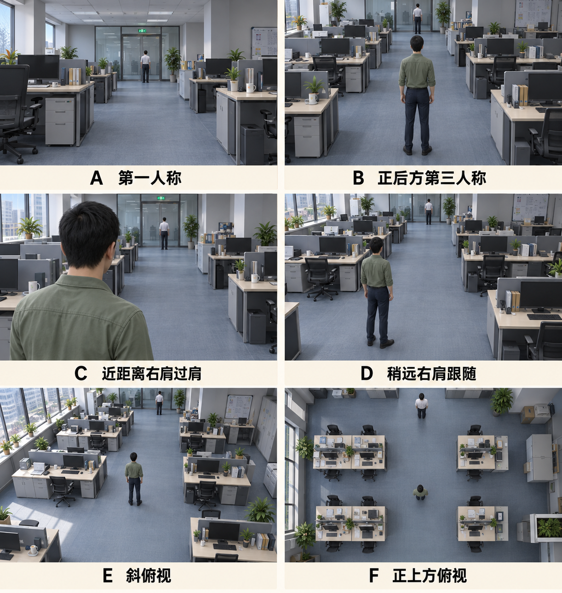

# 镜头构图与操作确认

更新日期：2026-09-23。适用当前正式第一关 `1.0.1`；本轮本地稳定性验证已完成，尚未上传。本轮用户要求方向键自由调整视角、WASD 只控制人物，并兼顾容易上手；上传前先排查频闪和稳定性。新验证见 [发布前稳定性测试记录](发布前稳定性测试记录.md)，P1 的旧验证范围独立保留。

## 1. 用户选择的构图

用户选择 **D：稍远右肩跟随**。以角色右后上方、站立时基本能看见全身的构图为初始参考，玩家可以调节镜头远近。镜头在角色右后方时，角色通常出现在画面偏左的位置。

本图由内置 imagegen 生成，用于构图沟通，不是游戏实机截图，也不代表最终人物、场景资产或画质要求。A～F 是选项，只有 D 被选为基础构图。

## 2. 当前操作与易玩辅助

| 输入／状态 | 行为 |
|---|---|
| W / S | 沿人物朝向前进／倒退；倒退不改变人物朝向，不让镜头绕到人物前方 |
| A / D | 向左／右转身，可原地转身；不作横移 |
| 方向键 ← / → | 镜头左右环绕，不改变人物朝向 |
| 方向键 ↑ / ↓ | 镜头上下俯仰，在允许范围内观察 |
| 按住右键拖动 | 同样可以左右环绕、上下俯仰；保留鼠标操作选择 |
| 持续操作镜头 | 自由观察优先，自动回正不抢镜头；WASD 可继续控制人物 |
| 松开镜头控制 | 暂留 1.25 秒；未继续移动或转身则保留，移动触发回正后平滑完成，方向键或右键观察可随时打断 |
| 鼠标滚轮 | 调节远近；遇障碍时实际距离可暂时缩短 |
| F | 快速回到人物后方和默认 14° 俯角，保留滚轮所选距离 |
| 蹲起／翻滚 | 镜头不继承动画姿态，仍跟随人物实际位置 |
| 暂停／失焦 | 停止人物和镜头输入，恢复时不延续已经释放的操作 |

方向键与 WASD 分工是用户本轮明确要求。1.25 秒暂留、俯仰范围、键盘转速和回正速度是为平衡易玩性采用的可调默认，不能写成用户逐项最终定稿。没有主动观察时，镜头保持通常的肩后跟随；需要重新辨认人物方向时，可以先按 F 再用 W 前进。

观察不带动人物转身，W/S 的前后方向不随观察镜头变化。自动回正和 F 都以人物的**水平朝向**为参照，不能改用实际位移方向，否则倒退会使镜头反转。回正不会重置缩放距离。

## 3. 稳定性与避障要求

- 镜头跟随人物实际位置，不绑定头骨、脊柱或动画旋转。蹲起不使镜头自动升降，翻滚不使镜头翻转或摇晃。
- 玩家主动上下观察与动画引起的俯仰必须区分；人物动作不能覆盖玩家选定的观察角度。
- 方向键、右键、上下俯仰、缩放与回正均须兼容墙体避障。不能为维持构图而穿墙，墙边收缩和恢复也不能反复跳变。
- 镜头能比角色略早看到转角是允许的；领导发现玩家仍依据真实身体，不依据摄影机位置。
- 浏览器获得焦点后方向键应控制游戏镜头；菜单与暂停保留正常界面操作，不能误把菜单导航当作游玩观察。

当前基础镜距沿用 1.8～7.0 米、默认 4.8 米，右偏 0.65 米，默认俯角 14°；遇障碍可缩得更近。近距离角色淡出只改变显示，不改变实体碰撞。当前俯仰范围 −12°～50°，键盘左右转速 90°／秒、上下 65°／秒；斜向组合使用归一化输入，鼠标灵敏度独立可调。暂留与速度等参数可按试玩反馈调整。

## 4. 本轮验证方向

1. 方向键上下左右均只改变镜头，W/S 和 A/D 的人物控制不被镜头角度改变。
2. 原地与移动中观察、松开后的暂留、静止保留、移动后的缓慢回正，以及 F 回正与保留镜距。
3. 右键上下左右观察与方向键切换、组合输入、相反方向键和灵敏度设置。
4. 上下限角度、贴墙、窄角、缩放、翻滚与重新开始中的连续帧稳定性。
5. 暂停、失焦和鼠标捕获恢复后无残留输入；浏览器方向键不滚动宿主页面。
6. 组长视线提示在观察周期、静止与蹲姿变化时的连续画面，实际感知和失败判定仍保持正确。

本清单已完成相应本地验证，结果见 [发布前稳定性测试记录](发布前稳定性测试记录.md)。连续画面、真实输入与几何采样分别留证，单张截图与引擎通过数不能独立证明没有视觉闪烁；实际托管仍需单独验收。

## 5. 历史规则与证据

2026-09-20 的“跟随行走方向”已由 2026-09-21 的 W/S 前后移动、A/D 转身及人物水平朝向参照替代。P1 当时只支持右键水平环绕，并在恢复移动时立即进入平滑回正；本轮方向键、上下观察和暂留辅助替代正式 release 的对应旧规则，历史样板与测试记录不倒改。

P1 已通过 86 项基础回归、8 项几何回归、15 项镜头稳定性检查（包含原路线 9 项）及 Chrome 43 项检查，另覆盖 120 FPS 渲染与 60 FPS 物理交错；当时修复窄角跳动与共面墙面频闪。这些证据见 [P1 测试记录](P1测试记录.md)，不能代替 1.0.1 新自由视角与领导提示的验收。

已确认的行为可直接实施，当前用户授权继续本阶段；只有新增且影响玩法方向的不明确选择才需要再次沟通。速度、暂留时间等实施参数可按验证和试玩反馈调整，不重复请求已经给予的开发授权。
